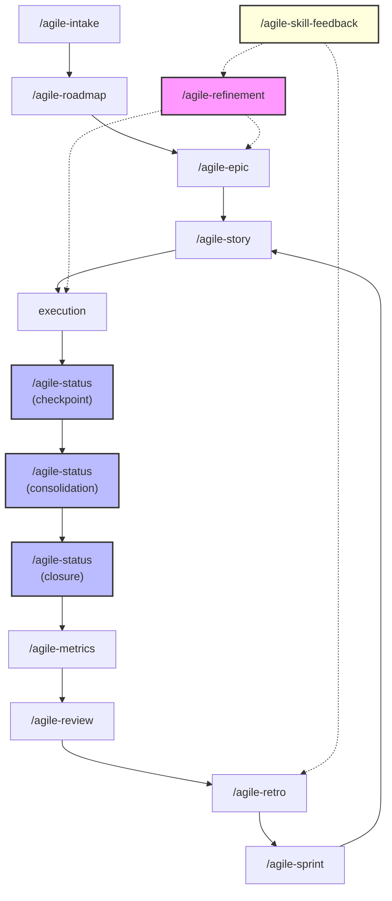

# Agile Workflow

Skills for agile delivery management powered by AI agents.

## Workflow

## Guides

Scenario-based guides showing how skills chain together in real situations.

| Guide                                                              | What you'll learn                                                 |
| ------------------------------------------------------------------ | ----------------------------------------------------------------- |
| [From Idea to Delivery](guides/from-idea-to-delivery.md)           | End-to-end: intake -> epic/task -> refinement -> status           |
| [Managing Large Initiatives](guides/managing-large-initiatives.md) | Epic-scale: roadmap -> epic -> task -> status                     |
| [Sprint Lifecycle](guides/sprint-lifecycle.md)                     | Ceremonies: planning -> status -> review -> metrics -> retro      |
| [Getting Started](guides/getting-started.md)                       | Onboarding, prototyping, decision trees, and cheat sheet          |

## Skills

Each skill README contains full documentation with examples, tips, and chaining info.

### Intake & Planning

| Skill | Usage |
|-------|-------|
| [intake](../../skills/agile-intake/README.md) | Vague problems -> structured intake document |
| [roadmap](../../skills/agile-roadmap/README.md) | Quarterly or initiative roadmap |
| [epic](../../skills/agile-epic/README.md) | Large initiative -> story backlog + roadmap |
| [task](../../skills/agile-story/README.md) | Small, localized change -> execution plan |

### Validation & Review

| Skill | Usage |
|-------|-------|
| [refinement](../../skills/agile-refinement/README.md) | Validate planning artifacts + review code |
| [tdd](../../skills/agile-tdd/README.md) | TDD cycle + pragmatic testing strategy |
| [skill-feedback](../../skills/agile-skill-feedback/README.md) | Improve, merge, split, deprecate, or remove skills from real usage evidence |

### Delivery & Tracking

| Skill | Usage |
|-------|-------|
| [status](../../skills/agile-status/README.md) | Progress tracking: checkpoint, consolidation, closure |

### Sprint Ceremonies

| Skill | Usage |
|-------|-------|
| [planning](../../skills/agile-sprint/README.md) | Plan cycle: objective, items, capacity |
| [review](../../skills/agile-review/README.md) | Review + demo for stakeholders |
| [metrics](../../skills/agile-metrics/README.md) | Objective sprint metrics |
| [retro](../../skills/agile-retro/README.md) | Retrospective with improvement actions |

### Routing & Prototyping

| Skill | Usage |
|-------|-------|
| [router](../../skills/agile-router/README.md) | Guidance on which skill to use |
| [proto](../../skills/agile-proto/README.md) | Interactive UI prototypes |

### Onboarding

| Skill | Usage |
|-------|-------|
| [onboarding](../../skills/agile-onboarding/README.md) | New member onboarding guide |
