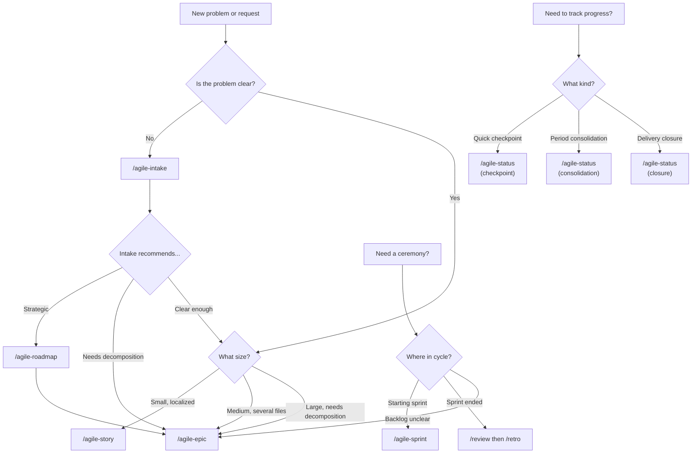

# Getting Started

How to onboard into the agile + AI workflow, choose the right skill, and validate ideas with prototypes before committing to implementation.

**Skills covered:** onboarding, proto, router

---

## Quick reference: Which skill do I use?

### Decision tree



### Cheat sheet

| I need to... | Use |
|---|---|
| Capture a vague problem | `/agile-intake` |
| Decide which skill to use | `/agile-router` |
| Plan a small, localized change | `/agile-story` |
| Decompose and structure a large initiative | `/agile-epic` |
| Set strategic direction | `/agile-roadmap` (then `/agile-epic`) |
| Validate planning artifacts | `/agile-refinement` (planning lint mode) |
| Review code before committing | `/agile-refinement` (code review mode) |
| Quick daily checkpoint | `/agile-status` (checkpoint mode) |
| Period/milestone consolidation | `/agile-status` (consolidation mode) |
| Close a delivery formally | `/agile-status` (closure mode) |
| Plan a sprint | `/agile-sprint` |
| Demo deliveries to stakeholders | `/agile-review` |
| Get sprint numbers | `/agile-metrics` |
| Reflect and improve | `/agile-retro` |
| Validate a UI flow in a static HTM UI browser prototype | `/agile-proto` |
| Validate a UI flow as explicit Pen.dev states | `/agile-pen` |
| Onboard a new team member | `/agile-onboarding` |

---

## Scenario A -- Onboarding a new backend developer

A new backend dev joins the team and needs to learn the flow.

### The 5-day trail

```
/onboarding
```

**Day 1 -- Understand the model:**
- Walk through the complete flow: intake -> roadmap -> epic -> task -> execution -> status -> retro
- Explain role division: human decides, AI structures
- Show the decision tree above
- List all available skills

**Day 2 -- Practical exercise (intake + planning):**
- Pick a real small problem (e.g., "add rate limiting to the API")
- Run `/intake rate limiting` -> skill asks questions, structures the problem
- Use `/agile-router` to decide: it's a small change -> `/agile-story`
- Create the plan. Mentor reviews.

**Day 3 -- Practical exercise (TDD + execution):**
- Implement the rate limiting plan using TDD with AI as pair
- Write failing test (red), implement (green), refactor
- Run lint, typecheck, tests
- Run `/agile-refinement` (code review mode) -- review the diff together

**Day 4 -- Practical exercise (tracking):**
- Generate a `/agile-status` checkpoint for the rate limiting work
- Simulate a `/agile-status` consolidation for the week
- Close with `/agile-status` closure mode

**Day 5 -- Full solo cycle:**
- The dev picks a new problem and runs the entire cycle independently:
  intake -> task -> TDD -> status -> closure
- Mentor validates and gives final feedback

### Onboarding checklist

- [ ] Understands the complete flow (intake to retro)
- [ ] Knows how to choose the right artifact (decision tree)
- [ ] Can create a task or epic with AI support
- [ ] Knows how to use TDD with AI as pair
- [ ] Can generate status checkpoints and closure reports
- [ ] Understands the human vs AI responsibility division
- [ ] Knows which skills exist and when to use each
- [ ] Completed at least one full cycle with supervision

---

## Scenario B -- Onboarding a new scrum master

A new scrum master joins and needs to learn the ceremony skills.

```
/onboarding
```

The trail adapts for a management profile:

- **Focus:** `/agile-roadmap`, `/agile-epic`, `/agile-sprint`, `/agile-retro`, `/agile-status`
- **Less:** TDD implementation details
- **More:** Structuring backlogs, running ceremonies, tracking progress
- **Exercise:** Conduct a real `/agile-epic` decomposition for a backlog item, then run `/agile-sprint` with AI support
- **Same checklist** but with management emphasis

---

## Scenario C -- Prototyping before implementing

The design team wants to validate a 4-step onboarding wizard before engineering builds it.

### Create the prototype

```
/agile-pen onboarding wizard with 4 steps
```

The skill creates the flow in a project `.pen` document with separate frames for account info, team setup, integration preferences, confirmation, and any behavior-changing alternate states. Every frame receives a paired note and a stable ID shared with planning artifacts.

**Surface:** Pen.dev with the project-local ADS library configured from the root `DESIGN.md`.

Use realistic mock data, inspect the states in Pen.dev, and review the documented transitions with stakeholders.

### Validate and transition to real implementation

Stakeholders approve the flow but request changes:
- Merge steps 2 and 3 (too granular)
- Add a "skip for now" option on step 2

Update the prototype, re-validate, then:

```
/epic onboarding wizard implementation
```

The epic references the prototype as the validated design. Story acceptance criteria match the prototype behavior.

### Key rules for prototypes

- **Self-contained:** `client-proto/` has its own files, no build tools
- **daisyUI components:** Use the component wrappers provided
- **Icons via `<Icon>`:** Use `<Icon icon="lucide:search" />`, never `lucide-react`
- **Mock data inline:** Forms pre-filled, lists hardcoded
- **Prototypes are throwaway:** Don't architect for reuse

---

## Using the router when unsure

Don't know which skill to use?

```
/router add multi-language support to onboarding
```

The router evaluates: "Multi-language touches i18n, translation files, UI components, content management. This is a large initiative -- I recommend structuring it as an `/agile-epic`."

The router covers three areas:
- **Planning:** What artifact do I need? (task, epic, roadmap, intake)
- **Ceremonies:** Where am I in the sprint cycle? (planning, review, retro)
- **Tracking:** How do I report progress? (status checkpoint, consolidation, closure)

---

## Key takeaways

1. **Onboarding is practice, not reading:** The new member does real work from Day 2
2. **Adapt by role:** Devs focus on TDD, managers focus on ceremonies
3. **Prototype before implementing:** Validate UI flows interactively, then transition to real epics
4. **When in doubt, use the router:** `/agile-router` guides you to the right skill
5. **The decision tree is your compass:** Print it, bookmark it, reference it until it's second nature
6. **Epic handles decomposition:** Large items go through `/agile-epic` for decomposition into stories
