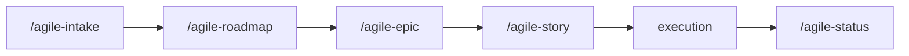

# agile-epic

Structures large initiatives into a decomposed story backlog with a roadmap, dependencies, and verification criteria. Now handles decomposition directly -- generates an overview file plus individual story files with context and tasks. Use when work requires several coordinated stories, has cross-dependencies between deliveries, or needs a phased roadmap.

## When to use

- After a `/agile-intake` or `/agile-roadmap` identified a large initiative
- An initiative is large, requiring multiple stories that can't be a single task
- There are dependencies between deliveries that need explicit sequencing
- A roadmap is needed to show phases, unblocks, and intermediate validations
- Medium work that needs richer structure than a simple `/agile-story`

## When NOT to use

- The work is small and localized -- use `/agile-story` instead
- The problem hasn't been captured yet -- use `/agile-intake` first
- You need strategic direction -- use `/agile-roadmap` first
- You need to validate existing artifacts or review code -- use `/agile-refinement`

## How to use

```
/agile-epic
```

Example: `/agile-epic auth-refactor`

## End-to-end examples

### Example 1: Structuring a multi-story payment system overhaul

The team needs to overhaul the payment system, touching billing, invoices, and payouts:

1. Start by invoking: `/agile-epic payment-system-overhaul`
2. The skill reads the existing intake and roadmap.
3. It decomposes by vertical value slice and generates multiple files:
   - `00-overview.md` -- epic overview with story backlog, roadmap, risks
   - `01-stripe-provider.md` -- Story 1 (small, no deps)
   - `02-webhook-handler.md` -- Story 2 (medium, depends on 1)
   - `03-payout-reconciliation.md` -- Story 3 (medium, depends on 1, 2)
   - `04-customer-migration.md` -- Story 4 (large, depends on 1)
   - `05-legacy-decommission.md` -- Story 5 (small, depends on 1-4)
4. Each story file contains context, acceptance criteria, files, tasks, and verification.
5. Save to: `planning/payment-system-overhaul/epics/01-payment-overhaul/`
6. The skill suggests: "Do you want to create the execution plan for Story 1 with `/agile-story`?"

### Example 2: Decomposing an onboarding optimization

A quarterly objective needs to be broken into deliverable stories:

1. Start by invoking: `/agile-epic onboarding-optimization`
2. The skill decomposes into 4 stories with sizes and dependencies.
3. Quick-win stories (small, no deps) can go directly to `/agile-story`.
4. Larger stories have richer acceptance criteria in their story files.

## File structure

```
planning/<initiative>/epics/NN-<epic-name>/
├── 00-overview.md         (epic overview: context, backlog, roadmap, risks)
├── 01-story-name.md       (story 1: context + tasks)
├── 02-story-name.md       (story 2: context + tasks)
└── ...
```

## Workflow integration



## Tips & pitfalls

- The epic now handles decomposition directly -- no separate refinement step needed.
- Break by vertical value slices, not by technical layers. "Stripe integration" is a good story; "backend changes" is not.
- The roadmap in the overview must show dependencies and unblocks, not just chronological order.
- Update story statuses (not started -> in progress -> completed) as the epic progresses.
- Each story file must be self-contained enough to be planned and executed independently.

## Chaining

- **Before:** `/agile-intake` (capture the problem), `/agile-roadmap` (strategic direction)
- **After:** `/agile-story` (create execution plans for individual stories), `/agile-refinement` (validate artifacts)
