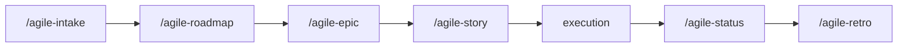

# agile-onboarding

Guides new team members through the agile + AI workflow in a progressive, hands-on 5-day trail. It covers the entire pipeline from intake to retrospective, ensuring the new member can operate autonomously within 1-2 sprints. Onboarding is practice, not passive reading.

## When to use

- A new dev or manager joins the team
- Someone changes roles (e.g., dev becomes tech lead)
- The team adopts the agile + AI flow for the first time
- Someone returns after time away and needs retraining

## When NOT to use

- You just need to plan work -- use `/agile-sprint` or `/agile-story` instead
- You need to create an artifact -- use the specific skill (intake, epic, etc.)
- You want to track progress -- use `/agile-status` instead
- You need a code review -- use `/agile-refinement` instead

## How to use

```
/agile-onboarding
```

Example: `/agile-onboarding new-dev`

## End-to-end examples

### Example 1: Onboarding a new backend developer

A new backend dev joins the team:

1. Start by invoking: `/agile-onboarding`
2. The skill presents the 5-day trail:
   - **Day 1:** Walk through the complete flow (intake -> roadmap -> epic -> task -> execution -> status -> retro). Show the decision tree and available skills.
   - **Day 2:** Pick a real small problem. Run `/agile-intake`, use `/agile-router` to decide, create the plan with `/agile-story`. Mentor reviews.
   - **Day 3:** Implement using TDD with AI as pair. Run `/agile-refinement` (code review mode).
   - **Day 4:** Generate `/agile-status` checkpoints and closure.
   - **Day 5:** Full solo cycle. Mentor validates.

### Example 2: Onboarding a new scrum master

A new scrum master joins:

1. Start by invoking: `/agile-onboarding`
2. Trail adapts for management: focus on `/agile-roadmap`, `/agile-epic`, `/agile-sprint`, `/agile-retro`, `/agile-status`.

## Workflow integration



## Tips & pitfalls

- Onboarding is not passive. The new member must practice, not just read.
- The mentor guides and reviews -- they don't do the work for the new member.
- Mistakes during onboarding are learning opportunities.
- If the checklist can't be completed in 5 days, the problem may be the process. Discuss in retro.
- Adapt by profile: devs need more TDD focus, managers need more ceremony focus.

## Chaining

- **Before:** Nothing -- onboarding is the entry point before any other skill.
- **After:** The new member should be able to use `/agile-router`, `/agile-story`, `/agile-status`, `/agile-sprint`, and `/agile-refinement` autonomously.
