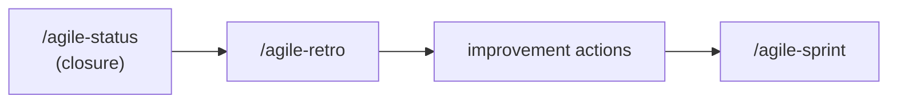

# agile-retro

Conducts a retrospective that transforms reflection into concrete improvement actions with owners and deadlines. A retro is not a venting session or meeting minutes -- it's an improvement tool that separates facts from opinions, identifies root causes, and generates 2-3 actionable changes for the next cycle. Now also absorbs post-implementation reflection aspects.

## When to use

- A sprint or delivery cycle has ended
- The team needs to reflect on what worked and what needs to change
- Before starting the next sprint -- retro feeds sprint planning
- After closing a significant delivery (via `/agile-status` closure mode)
- Per-delivery or per-sprint reflection

## When NOT to use

- Mid-sprint status -- use `/agile-status` (checkpoint mode) instead
- Planning the next sprint -- use `/agile-sprint` instead (but retro should feed into it)
- Closing a delivery with verification -- use `/agile-status` (closure mode) first, then retro
- You need metrics/data -- use `/agile-metrics` first, then retro

## How to use

```
/agile-retro
```

Example: `/agile-retro sprint-12`

## End-to-end examples

### Example 1: Sprint 23 retro for the payments team

Sprint 23 just ended. The team delivered 3 of 5 stories and hit 2 major blockers:

1. Start by invoking: `/agile-retro Sprint 23`
2. The skill collects inputs from status closure reports, checkpoints, and sprint metrics.
3. It separates facts from perceptions.
4. It analyzes what worked and what didn't, with root causes.
5. It defines 2 actions with owners and deadlines.
6. Save to: `planning/retros/retro-2026-04-11.md`

### Example 2: Retro after a delivery closure

The team just finished Phase 1 of the platform migration:

1. Start by invoking: `/agile-retro platform-migration phase 1`
2. The skill reads the closure report and reflects on delivery outcomes.
3. Structures what worked, what didn't, and what to do differently.
4. Save to: `planning/platform-migration/retro.md`

## Workflow integration



## Tips & pitfalls

- Retro is an improvement tool, not a venting session or meeting minutes archive.
- Actions must be specific and executable. "Improve communication" is not an action.
- Each action must have an owner. An action without an owner won't happen.
- Limit to 2-3 actions per retro. Many actions = none executed.
- If the same action appears in consecutive retros, the problem is deeper. Discuss root cause.
- Separate facts from opinions. Both matter, but they're different.

## Chaining

- **Before:** `/agile-status` (closure mode), `/agile-metrics` (get data for the retro)
- **After:** Improvement actions may become `/agile-story` or `/agile-epic` items. Process changes feed back into `/agile-sprint`. The next cycle starts with `/agile-sprint`.
