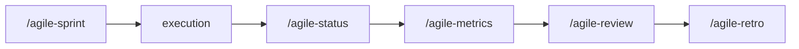

# agile-review

Consolidates sprint deliveries into a clear, objective review and demo format for stakeholders. It shows what was delivered, what changed in scope, what's pending, and what decisions are needed. The review shows what **was delivered**, not what's in progress -- for status updates, use `/agile-status`.

## When to use

- At the end of a sprint, before the retro
- Stakeholders need to see the result of deliveries
- You need to validate that the product is on track
- To close the cycle between sprint planning and retrospective

## When NOT to use

- Mid-sprint status -- use `/agile-status` instead
- Reflecting on process -- use `/agile-retro` instead (review shows results, retro discusses process)
- Planning the next sprint -- use `/agile-sprint` instead
- Getting quantitative metrics -- use `/agile-metrics` instead (review shows value, metrics show numbers)

## How to use

```
/agile-review
```

Example: `/agile-review sprint-12`

## End-to-end examples

### Example 1: Sprint Review for Sprint 23

Sprint 23 is done. Three stories delivered, two were not:

1. Start by invoking: `/agile-review Sprint 23`
2. The skill collects data from completed issues, status closure reports, and checkpoints.
3. It organizes the demo by business value, identifies undelivered items, and collects feedback.
4. Save to: `planning/sprints/sprint-23-review.md`

### Example 2: Lean sprint review for a solo dev

A solo dev finished a 1-week cycle:

1. Start by invoking: `/agile-review week of April 7`
2. The skill consolidates deliveries and presents inline.

## Workflow integration



## Tips & pitfalls

- The review shows what **was delivered**, not what is in progress.
- Be honest about what was not delivered and why. Hiding cut items breaks trust.
- Organize the demo by business value, not technical order.
- The demo must be verifiable -- stakeholders should confirm the result is real.
- Collected feedback must become backlog items or actions, not just meeting notes.

## Chaining

- **Before:** `/agile-status` (closure reports), `/agile-metrics` (quantitative data)
- **After:** `/agile-retro` (discuss process), `/agile-sprint` (feedback feeds next sprint)
