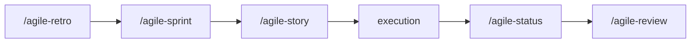

# agile-sprint

Plans a sprint by selecting backlog items, declaring an objective, recording capacity and constraints, and defining execution order. Use at the beginning of a work cycle to align on what will be delivered and how dependencies will be managed.

## When to use

- Starting a new sprint or work cycle
- After epic decomposition is done and stories are ready for execution
- After a retro (retro improvement actions may become sprint items)
- You need to define what the team commits to delivering this cycle

## When NOT to use

- Mid-sprint status -- use `/agile-status` instead
- Decomposing large items -- use `/agile-epic` first
- Closing a delivery -- use `/agile-status` (closure mode) instead
- Reflecting on a past sprint -- use `/agile-retro` or `/agile-metrics`

## How to use

```
/agile-sprint
```

Example: `/agile-sprint sprint-13`

## End-to-end examples

### Example 1: Planning Sprint 24 for the payments team

After Sprint 23's retro identified improvement actions:

1. Start by invoking: `/agile-sprint Sprint 24`
2. The skill reads the epic, retro actions, and backlog.
3. It declares the sprint objective, reviews and selects items, validates DoR.
4. It orders execution and records commitments.
5. Save to: `planning/sprints/sprint-2026-04-11.md`
6. The skill suggests: "Do you want to create the execution plan with `/agile-story`?"

### Example 2: Quick sprint planning for a solo dev

A solo dev is starting a 1-week cycle:

1. Start by invoking: `/agile-sprint week of April 14`
2. The dev lists items from the backlog, the skill validates DoR and capacity.
3. Save to: `planning/sprints/sprint-2026-04-14.md`

## Workflow integration



## Tips & pitfalls

- Don't select more items than capacity allows.
- Every item must have Definition of Ready (DoR). Without DoR, it goes back for decomposition.
- The sprint objective must be observable. "Improve the system" is not. "Deliver payout reconciliation" is.
- Make dependencies explicit. Don't assume "it will fit".
- Sprint planning feeds execution. If planning doesn't generate clarity, execution will suffer.

## Chaining

- **Before:** `/agile-epic` (ensure items are decomposed), `/agile-retro` (improvement actions become sprint items)
- **After:** `/agile-story` (detail the first sprint item), then execution begins
