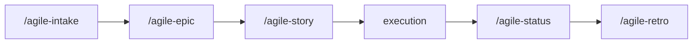

# agile-story

Creates a clear, proportionally-sized execution plan for small and localized changes. It maps exact files, defines verifiable tasks, and produces a checklist-ready artifact that can be implemented immediately. It's the last step before writing code. Also used for individual story execution from an epic.

## When to use

- Small and localized work -- a bug fix, a config change, a single feature
- Few impacted files and a single implementation cycle
- A story from an epic that needs an operational execution plan
- The problem is already clear and you just need to map out what to change

## When NOT to use

- Large work needing decomposition -- use `/agile-epic` instead
- The problem isn't clear yet -- use `/agile-intake` first
- Multiple dependent deliveries -- use `/agile-epic` instead
- You need to validate artifacts or review code -- use `/agile-refinement`

## How to use

```
/agile-story
```

Example: `/agile-story add-button-component`

## End-to-end examples

### Example 1: Planning a bug fix for password reset expiry

A bug report shows password reset tokens never expire:

1. Start by invoking: `/agile-story password reset tokens not expiring`
2. The skill explores the code and identifies the relevant files.
3. It builds the plan with context, files, tasks, and verification.
4. Save to: `.agents/plans/password-reset-expiry.md`
5. After confirmation, implement following the checklist.
6. When done, the skill suggests: `/agile-status` (closure mode) to close the delivery.

### Example 2: Executing a story from an epic

A story from the payments epic needs an execution plan:

1. Start by invoking: `/agile-story planning/payment-migration/epics/01-payment-overhaul/02-webhook-handler.md`
2. The skill reads the story file and adds detailed execution tasks and file mappings.
3. The tasks and verification sections are added to the existing story file.
4. Implement following the checklist.

## File locations

- **Standalone:** `.agents/plans/<name>.md`
- **Part of an initiative:** `planning/<initiative>/epics/NN-<epic>/NN-story-name.md` (tasks added to story file)

## Workflow integration



## Tips & pitfalls

- Always present the plan before implementing. Get explicit user confirmation.
- Files must have exact paths, not vague areas like "the auth module". Explore the code first.
- Tasks must be verifiable -- "implement X" is not a task; "add expiry check to verifyResetToken in tokens.ts" is.
- When a task is completed, update `[ ]` to `[x]` in the plan.
- If the work turns out to be bigger than expected mid-plan, stop and suggest `/agile-epic` instead.

## Chaining

- **Before:** `/agile-intake` (capture problem), `/agile-epic` (for larger initiatives)
- **After:** Execute the plan, then `/agile-status` (closure mode) to formally close the delivery.
