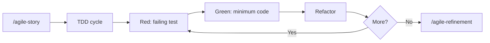

# agile-tdd

Guides the TDD (Test-Driven Development) cycle and pragmatic testing strategy. Follows the Red-Green-Refactor pattern, applies the test pyramid with sensible coverage targets, and enforces best practices like AAA pattern, factory-based data, and behavior-focused tests.

Ships with an **optional opt-in enforcement layer** (templates + hooks) that turns the TDD rule into a project-level guardrail — see [Enforcement layer](#enforcement-layer-optional-opt-in-per-project) below.

## When to use

- Starting a new feature with TDD (Red-Green-Refactor).
- Adding tests to existing code that lacks coverage.
- Deciding between unit, integration, or E2E tests for a module.
- Establishing a testing strategy for a codebase.
- Choosing valuable front-end integration tests for validations, API contracts, permissions, offline/sync behavior, or critical flows.
- Installing the enforcement layer in a project where ad-hoc TDD discipline has proven unreliable.

## When NOT to use

- Quick prototypes — use `/agile-proto` instead.
- Throwaway scripts or documentation-only changes.
- You need to plan the feature first — use `/agile-story` or `/agile-epic`.

## How to use

```
/agile-tdd
```

Example: `/agile-tdd payment service`.

## End-to-end examples

### Example 1 — Adding tests to a utility module

A `utils/currency.ts` module has zero test coverage:

1. Invoke: `/agile-tdd utils/currency.ts`.
2. The skill analyzes the module and identifies public functions.
3. Red phase: writes a failing test for `formatCurrency()`.
4. Green phase: verifies the function passes (it already exists, so the test should pass — if not, the function has a bug).
5. Continues for `parseCurrency()`, `convertRate()`, etc.
6. Runs `bun test --coverage` (or project equivalent) and checks against the 85%+ target for utils.
7. Reports coverage gaps and suggests next steps.

### Example 2 — TDD for a new feature

Building a new `NotificationService` from scratch:

1. Invoke: `/agile-tdd notification service -- send, schedule, cancel`.
2. Red: writes a failing test for `send()` — the service does not exist yet.
3. Green: creates the minimum `NotificationService.send()` to pass.
4. Refactor: extracts common setup into a factory.
5. Repeats for `schedule()` and `cancel()`.
6. Integration test: writes a test that verifies notifications are persisted to the database.
7. Final coverage check against the 80%+ target for services.

### Example 3 — Installing enforcement in a new project

You want the project to refuse `Write/Edit` on source files that lack a companion test (no more "I forgot to write the test first").

1. Read [Enforcement layer](#enforcement-layer-optional-opt-in-per-project) below.
2. Copy `templates/tdd-guardrails.yml.tmpl` to `<project-root>/.tdd-guardrails.yml`. Edit `source_paths` and `exemptions` to match the repo layout. Pick `mode: warn` first; flip to `mode: block` once the team is comfortable.
3. Copy the hook templates and register them in `.claude/settings.json`, `.codex/hooks.json`, and `.opencode/plugins/`.
4. Append the contents of `templates/agents-block.md.tmpl` to `AGENTS.md` and `CLAUDE.md` so future agents see the rule.
5. Verify by simulation: pipe a fake `Write` payload through `tdd-pre-write.sh` and confirm it warns when no test exists.

## Enforcement layer (optional, opt-in per project)

Beyond advisory guidance, the skill ships hook templates that check, at the file-write level, that source files have companion tests — without the agent having to remember to invoke this skill.

### What gets enforced

- **PreToolUse on `Write|Edit|MultiEdit`** — if the target file matches `source_paths` in `.tdd-guardrails.yml` and a companion test does not exist, the hook warns (`mode: warn`) or blocks the tool call (`mode: block`).
- **Stop hook** (Claude Code / Codex) — at session end, scans the git diff and reports source files touched without a companion test.
- **SessionStart hook** — announces enforcement is active.

### Config (`.tdd-guardrails.yml`)

| Key | Meaning |
|---|---|
| `enabled` | Global on/off |
| `mode` | `warn` (stderr only) or `block` (PreToolUse rejects the call) |
| `source_paths` | Globs that require a companion test |
| `test_strategy` | `sibling` (`foo.ts` → `foo.test.ts`), `sibling_dir` (`__tests__/foo.test.ts`), or `tests_root` (`<app>/tests/integration/foo.test.ts`) |
| `exemptions` | Globs allowed without a test (entry points, generated files, UI primitives) |

Patterns use **bash `case` globs**, not extended globstar. `*` matches any sequence including `/`; there is no `**`. So `apps/*/src/*.ts` matches both `apps/server/src/handler.ts` and `apps/server/src/auth/handler.ts`.

### Harness compatibility matrix

| Harness | Entry point | Pre-write event | Stop equivalent | Session start |
|---|---|---|---|---|
| Claude Code | `.claude/settings.json` shell hooks | `PreToolUse` (matcher `Write\|Edit\|MultiEdit`) | `Stop` | `SessionStart` |
| Codex | `.codex/hooks.json` shell hooks | `PreToolUse` (matcher `apply_patch\|Edit\|Write\|MultiEdit`) | `Stop` | `SessionStart` |
| OpenCode | `.opencode/plugins/tdd-guardrails.js` JS plugin | `tool.execute.before` | `session.idle` (closest available; audit shell is idempotent) | `session.created` |

OpenCode does **not** invoke shell scripts directly — its plugin orchestrates the same `.opencode/hooks/tdd-*.sh` scripts via `node:child_process.spawn`. Same policy logic, three entry points.

### Enforcement caveats

The hook checks **file-pair existence**. It does not, and cannot, verify:

- That the test was written **before** the source (no Red-before-Green order check).
- That the test actually exercises the source (no semantic match).
- That the test currently passes (no test execution).

Semantic discipline (one behavior per test, factories over hardcoded data, descriptive names, AAA) still belongs to the agent. The hooks are guardrails, not a guarantee.

### Bypassing intentionally

- **One path:** add it to `.tdd-guardrails.yml → exemptions` with a comment explaining why (entry point, generated, UI primitive, etc.).
- **One session:** temporarily `enabled: false` (and revert before commit).
- **Never delete the test file just to silence the hook** — that defeats the point.

## Workflow integration



When the optional enforcement is installed, the file-pair check fires automatically on every `Write/Edit/MultiEdit` tool call — no extra invocation required.

## Tips & pitfalls

- Always start with a failing test. If the test passes immediately, you either wrote the wrong test or the behavior already exists.
- Use factories (`faker`) for test data. Hardcoded strings like `"test@test.com"` hide assumptions and make tests brittle.
- Do not mock your own code. Mock external dependencies (APIs, databases, third-party services).
- One concept per test. If a test name has "and" in it, split it.
- Run tests in watch mode during development for fast feedback.
- For front-end, avoid tests that only confirm static text or a button exists unless that assertion protects a real rule or known regression.
- Pick `mode: warn` first when introducing enforcement; flip to `mode: block` after the team is comfortable. Hard-blocking from day one creates frustration.
- Exemptions are not free — every entry is a path that does not get checked. Review periodically and remove items that no longer apply.

## Chaining

- **Before:** `/agile-story` (plan what to build), `/agile-epic` (for larger initiatives).
- **During:** TDD cycle runs alongside implementation. Enforcement hooks (if installed) fire automatically.
- **After:** `/agile-refinement` (review test quality), `/agile-status` (closure mode to verify coverage), `/agile-skill-feedback` if TDD exposed a repeatable process gap.
