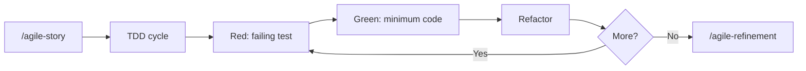

# agile-tdd

Guides the TDD (Test-Driven Development) cycle and pragmatic testing strategy. Follows the Red-Green-Refactor pattern, applies the test pyramid with sensible coverage targets, and enforces best practices like AAA pattern, factory-based data, and behavior-focused tests.

## When to use

- Starting a new feature with TDD (Red-Green-Refactor)
- Adding tests to existing code that lacks coverage
- Deciding between unit, integration, or E2E tests for a module
- Establishing a testing strategy for a codebase
- Choosing valuable front-end integration tests for validations, API contracts, permissions, offline/sync behavior, or critical flows

## When NOT to use

- Quick prototypes -- use `/agile-proto` instead
- Throwaway scripts or documentation-only changes
- You need to plan the feature first -- use `/agile-story` or `/agile-epic`

## How to use

```
/agile-tdd
```

Example: `/agile-tdd payment service`

## End-to-end examples

### Example 1: Adding tests to a utility module

A `utils/currency.ts` module has zero test coverage:

1. Invoke: `/agile-tdd utils/currency.ts`
2. The skill analyzes the module and identifies public functions.
3. It starts the Red phase: writes a failing test for `formatCurrency()`.
4. Green phase: verifies the function passes (it already exists, so the test should pass -- if not, the function has a bug).
5. Continues for `parseCurrency()`, `convertRate()`, etc.
6. Runs `bun test --coverage` and checks against the 85%+ target for utils.
7. Reports coverage gaps and suggests next steps.

### Example 2: TDD for a new feature

Building a new `NotificationService` from scratch:

1. Invoke: `/agile-tdd notification service -- send, schedule, cancel`
2. Red: writes a failing test for `send()` -- the service does not exist yet.
3. Green: creates the minimum `NotificationService.send()` to pass.
4. Refactor: extracts common setup into a factory.
5. Repeats for `schedule()` and `cancel()`.
6. Integration test: writes a test that verifies notifications are persisted to the database.
7. Final coverage check against the 80%+ target for services.

## Workflow integration



## Tips & pitfalls

- Always start with a failing test. If the test passes immediately, you either wrote the wrong test or the behavior already exists.
- Use factories (`faker`) for test data. Hardcoded strings like `"test@test.com"` hide assumptions and make tests brittle.
- Do not mock your own code. Mock external dependencies (APIs, databases, third-party services).
- One concept per test. If a test name has "and" in it, split it.
- Run tests in watch mode during development for fast feedback.
- For front-end, avoid tests that only confirm static text or a button exists unless that assertion protects a real rule or known regression.

## Chaining

- **Before:** `/agile-story` (plan what to build), `/agile-epic` (for larger initiatives)
- **During:** TDD cycle runs alongside implementation
- **After:** `/agile-refinement` (review test quality), `/agile-status` (closure mode to verify coverage), `/agile-skill-feedback` if TDD exposed a repeatable process gap
