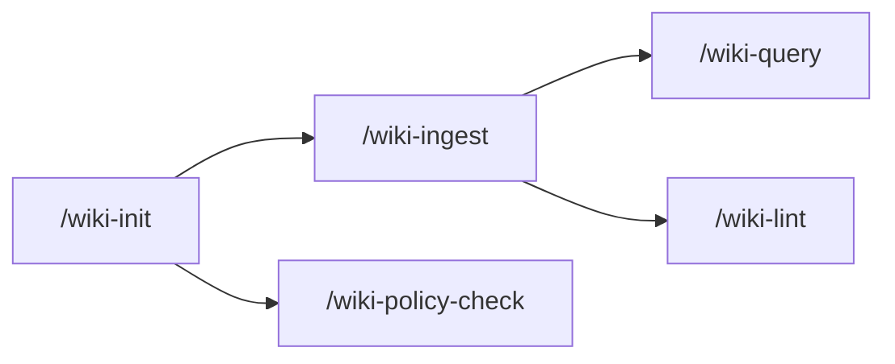

# wiki-init

Initializes a repo into the **wiki + QMD + agent-hook pattern**: scaffolds the per-harness configs (Claude / Codex / OpenCode), wires the QMD MCP server, installs guardrail hooks, and runs a doctor that surfaces drift and missing pieces. Pairs with `/wiki-ingest`, `/wiki-query`, `/wiki-lint`, and `/wiki-policy-check`.

## When to use

- Bootstrapping a new project that should follow the Karpathy LLM-Wiki pattern.
- Migrating an existing project into the wiki pattern (legacy markdown spread across the repo → consolidated under `wiki/`).
- Diagnosing wiki health on an already-initialized project (`doctor` mode is always safe and read-only).
- Patching managed QMD checkout, hook scripts, or `AGENTS.md` / `CLAUDE.md` blocks that drifted from the latest templates.

## When NOT to use

- The project does not need a domain knowledge wiki (e.g., this skills repo itself — see [`CLAUDE.md`](../../CLAUDE.md) note).
- You just need to ingest a source into an already-initialized wiki — use `/wiki-ingest`.
- You only want to query — use `/wiki-query`.

## How to use

```
/wiki-init
```

Natural-language routing handles intent. Examples:

- "como esta a estrutura?", "preciso migrar?", "doctor", "qmd esta ok?" → runs `doctor` (read-only).
- "instala", "prepara esse repo", "configura hooks" → runs `install` as dry-run first, asks to confirm wiki location and index, then `--write`.
- "migrar para o formato novo" → `migrate` dry-run + confirm + `--write`.
- "corrigir qmd", "managed qmd", "patch qmd" → `doctor` then `install --write` or `update-hooks --write`.

## End-to-end examples

### Example 1 — Fresh project

A new sample project `reserva-pwa` sits as a sibling of the skills repo.

1. `/wiki-init` invoked with the project path and a one-line goal.
2. Doctor reports `wiki_path: wiki (missing)`, suggests `local-wiki` topology and an index name derived from the project basename.
3. Skill asks the user (via the harness question tool — see [Prompting](../conventions.md#how-a-skill-asks-you-a-question--prompting)) to confirm:
   - **Wiki location** — local (`wiki/` in this repo) vs shared (external path).
   - **Harnesses to configure** — claude / codex / opencode.
4. `install --write` creates 22 files: `AGENTS.md`, `CLAUDE.md`, `.wiki-guardrails.yml`, `.mcp.json`, per-harness configs and hooks, QMD wrapper + manifest.
5. Final step is content scaffolding — the skill creates the minimum `wiki/index.md`, `wiki/CONVENTIONS.md`, `wiki/log.md`, audience subfolders (`business/`, `apps/`, `ops/`, `data/`, `sources/`), and `raw/index.md`. (Documented in `wiki-ingest/SKILL.md`; some installs also rely on `--seed-wiki` if available.)
6. `<wrapper> collection add wiki --name <index> --mask "**/*.md"`, `<wrapper> update`, `<wrapper> embed` — index ready.

### Example 2 — Doctor on a healthy project

Re-running `/wiki-init` later in `doctor` mode produces a report:

```
wiki_path: wiki (exists)
qmd_index: reserva-pwa
recommended_topology: local-wiki
harnesses: claude, codex, opencode

files:
- AGENTS.md: present
- CLAUDE.md: present
- .wiki-guardrails.yml: present
- .mcp.json: present
- .claude/settings.json: present
- .codex/hooks.json: present
- .codex/config.toml: present
- opencode.json: present
- .opencode/plugins/wiki-guardrails.js: present

markdown drift: none detected (allowlist)
installed drift: none detected (installed templates match the latest)
qmd: ok — version 2.1.0, patches ok
```

### Example 3 — Drift remediation

Doctor detects that the installed wiki-policy-check hook differs from the latest template:

```
installed drift:
- .claude/hooks/wiki-policy-check.sh (stale — outdated allowlist parser)
```

Run `wiki-init update-hooks --write` to refresh. Existing project guardrails (`.wiki-guardrails.yml`) are preserved as the local policy source; only the hook scripts and managed blocks are updated.

## Workflow integration



`wiki-init` is the entry point. Once initialized, `wiki-ingest` adds content, `wiki-query` retrieves it, `wiki-lint` keeps it healthy, and `wiki-policy-check` audits the surrounding code repo for business-rule leaks.

## Tips & pitfalls

- **Always start with `doctor`.** It is read-only, exhaustive, and lists every file the next `--write` would touch.
- **Confirm wiki location with the user.** Do not silently default to a sibling path — the choice branches the entire install (paths, hooks, presets).
- **Pass `--project <path>` explicitly** when the active CWD differs from the target project. The script does not fall back to CWD silently.
- **Bash `case` globs, not globstar.** `.wiki-guardrails.yml` and the hook scripts use bash `case` patterns where `*` matches `/`. There is no `**`. Use `apps/*/src/*.ts` to match nested files; the single `*` already crosses path separators in `case` matching.
- **Re-run `doctor` after every `--write`.** `installed drift: none detected` is the signal that the install is consistent.
- **Cache migration is preserved, not deleted.** Legacy `~/.local/share/essential-skills/qmd` cache is left in place when a new install is at `~/.local/share/skills/qmd`. Manual removal is the user's call.

## Chaining

- **Before:** nothing — entry point.
- **After:** `/wiki-ingest` to add the first source; `/wiki-query` to retrieve; `/wiki-lint` to audit. For repos that need business-rule boundary enforcement, also `/wiki-policy-check`.
