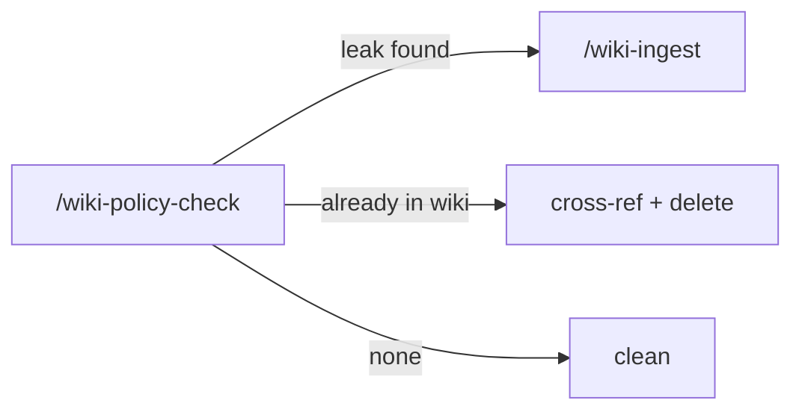

# wiki-policy-check

Audits a project (code repo) for **business-rule leaks** — content that should live in the central wiki rather than in the local repo. Read-only: it reports findings, never modifies files. The user decides what migrates.

The convention this skill enforces: **technical rules live in the project repo; business and product rules live in the central wiki.** Project-specific `CLAUDE.md` / `AGENTS.md` nuances override the generic policy.

## When to use

- After a long stretch of doc updates in a repo that has a wiki linked elsewhere.
- Before opening a PR that adds substantial documentation.
- Periodically (monthly cadence works in most projects).
- Whenever the user asks "is anything leaking?", "audit the docs", or similar.

## When NOT to use

- The project has no wiki convention configured — `/wiki-init` should run first.
- You want to migrate something specific you already identified — run `/wiki-ingest` directly from the wiki repo / folder.
- You want to modify files — this skill only reports. Use `/wiki-ingest` for actual migration.

## How to use

```
/wiki-policy-check
```

Or with a scope hint:

```
/wiki-policy-check just the apps/ folder
/wiki-policy-check diff against main
```

## End-to-end examples

### Example 1 — Periodic audit on a product repo

A SaaS app repo has accumulated docs over a sprint. Cancellation policy ended up in `docs/billing.md` instead of `wiki/business/cancellation.md`.

1. `/wiki-policy-check` invoked at the project root.
2. Skill reads `.wiki-guardrails.yml` for the markdown allowlist, sensitive paths, and the wiki location. Reads `CLAUDE.md`/`AGENTS.md` for project-specific business-rule definitions.
3. Scans every `.md` outside the allowlist. For each, classifies content:
   - **Pure technical** → no action.
   - **Pure business** (customer-facing, pricing, journey, compliance) → flagged for migration.
   - **Mixed** → flag the business chunks specifically.
4. Output table:

   | File | Excerpt | Type | Suggested action | Confidence |
   |---|---|---|---|---|
   | docs/billing.md:12 | "Cancellations within 24h are non-refundable" | business | migrate to wiki/business/cancellation.md | high |
   | README.md:78 | "We use React + TanStack Router" | technical | none | — |
   | docs/onboarding.md:5 | "Free tier is 100 reservations/month" | business | migrate to wiki/business/pricing.md | high |
   | docs/incident.md:22 | "Page oncall via PagerDuty escalation X" | mixed | migrate the policy clause, keep the runbook | medium |

5. Output also names the cross-checked wiki targets. If a page already exists, suggestion is **cross-ref + delete here**; if not, suggestion is **migrate via `/wiki-ingest`**.

### Example 2 — Focused diff scope

Before merging a PR that only touched `apps/server/`:

```
/wiki-policy-check diff against main
```

The skill restricts the scan to `git diff --name-only main...HEAD`, finds 2 markdown files changed, audits both, reports zero leaks. PR is clean from the wiki-boundary perspective.

### Example 3 — Marketing-copy special case

A public website repo has copy that encodes the pricing rule visibly: "Pro plan is $29/month".

1. Skill recognizes this as a special case: the **copy itself** has to live in the website (it has to render), but the **rule** belongs in the wiki.
2. Suggested action: keep the copy, but add a cross-reference to `wiki/business/pricing.md` so the rule has a canonical home and the copy can be regenerated from it if it changes.

## Workflow integration



The skill is paired with `/wiki-ingest` (which actually migrates content) and with `/wiki-lint` (which audits the wiki itself).

## Tips & pitfalls

- **Always read project policy first.** The project's `CLAUDE.md` may explicitly say "tax algorithms stay technical here" — that nuance overrides the generic signal list.
- **Default to flagging when in doubt.** The audit reports; the user decides. False positives are cheap; false negatives let leaks accumulate.
- **Be specific in excerpts.** Pull the actual quote, not a paraphrase. The user's decision depends on seeing the exact wording.
- **Skip auto-generated content** (build outputs, lockfiles, generated types, test results).
- **Do not duplicate.** If the rule already exists in the wiki, recommend cross-ref + delete here, not "migrate again".

## Generic signals (project policy overrides)

Almost-always leak indicators:

- **Pricing / monetization** — currency mentions, percentage rates, "monthly fee", "take-rate", plan names.
- **Customer-facing policies** — "cancellation", "refund", "no-show", "courtesy credit", "warranty", "ToS", "SLA".
- **Journeys / personas** — ICP language used as product framing.
- **Compliance posture** — LGPD, GDPR, CCPA, consent, retention, anonymization, liability statements.
- **Scope decisions** — "we will support X but not Y", anchor-customer commitments.
- **External integrations rationale** — when/why/billing impact (the "should we use it" is product).
- **Open product questions** — parked decisions, "decide later" markers.

## Chaining

- **Before:** `/wiki-init` (initial setup); ad-hoc invocation any time.
- **After:** `/wiki-ingest` (when the leak should migrate), `/wiki-lint` (after a batch of ingests cleaned up leaks).
