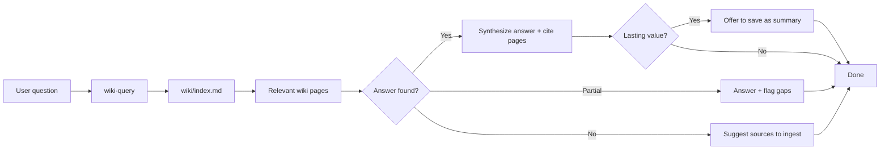

# wiki-query

Answer questions from the wiki knowledge base by searching existing pages, synthesizing information, and citing sources. When the answer reveals a knowledge gap, it suggests which sources to ingest next.

## When to use

- You need an answer about a concept, process, or entity that should be documented in the wiki
- You want to understand how something works before making changes (e.g., "How does the payment flow work?")
- The user asks "what does the wiki say about…", "how do we…", "where is… documented"

## When NOT to use

- You want to **add new content** to the wiki → use `wiki-ingest`
- You want to **check wiki health** (broken links, orphan pages) → use `wiki-lint`
- You need information **outside the wiki** (code, external docs) → search those sources directly, but consider ingesting them afterward

## How to use

```
/wiki-query
```

Example: `/wiki-query how does authentication work?`

## End-to-end examples

### Example 1: Querying how the payment flow works

A developer joins the team and needs to understand the payment processing architecture.

1. **Invoke the skill:** `/wiki-query How does the payment flow work, from checkout to confirmation?`
2. **Consult the index:** The skill reads `wiki/index.md` and locates relevant pages in the "Por tópico" table — `wiki/apps/payment-flow.md` and `wiki/data/payment-schema.md`.
3. **Read the pages** and follow related links (e.g., `wiki/ops/payment-monitoring.md`).
4. **Synthesize the answer:** The skill provides a direct answer in pt-BR, citing the wiki pages:
   - Checkout initiates via `PaymentService.createCharge()` ([payment-flow.md](wiki/apps/payment-flow.md))
   - Webhook from gateway confirms or fails the charge ([payment-monitoring.md](wiki/ops/payment-monitoring.md))
   - Charge records are stored in the `charges` table ([payment-schema.md](wiki/data/payment-schema.md))
5. **Evaluate lasting value:** The answer synthesizes three pages in a novel way. The skill offers to save it as a cross-cutting summary at `wiki/sources/payment-flow-summary.md`.
6. **Human declines** — it's a one-time question. No wiki update needed, no log entry.

### Example 2: Querying a gap in the wiki

Someone asks about the incident response escalation matrix.

1. **Invoke the skill:** `/wiki-query What is the incident response escalation matrix?`
2. **Consult the index:** No page directly covers "incident response escalation." The skill greps for "escalation" across wiki pages and finds only a brief mention in `wiki/ops/sprint-cadence.md`.
3. **Report the gap explicitly:** "The wiki does not contain a dedicated incident response escalation page. The topic is briefly mentioned in [sprint-cadence.md](wiki/ops/sprint-cadence.md) but lacks detail."
4. **Suggest sources to ingest:** "Consider ingesting the incident response runbook or PagerDuty configuration to cover this gap."
5. **No wiki update** — the skill logs nothing because no pages were changed.

### Example 3: Query uncovers contradictions

A product manager asks about the data retention policy.

1. **Invoke the skill:** `/wiki-query What is our data retention policy?`
2. **Consult the index:** Two pages are relevant — `wiki/business/data-privacy.md` and `wiki/ops/data-retention.md`.
3. **Read both pages** and discover a contradiction: the privacy page says 90 days, the retention page says 60 days.
4. **Present both viewpoints** with explicit notes about the contradiction:
   - Privacy policy states 90-day retention for personal data ([data-privacy.md](wiki/business/data-privacy.md))
   - Operations runbook states 60-day retention ([data-retention.md](wiki/ops/data-retention.md))
   - ⚠️ These contradict — clarification needed.
5. **Suggest a fix:** Run `/wiki-ingest` with the updated policy to resolve the contradiction.

## Workflow integration



## Tips & pitfalls

- **Always check the wiki first** — don't re-synthesize from code or external sources when the answer already exists in the wiki.
- **Cite wiki pages** with links in your answers so the reader can drill deeper.
- If the information **doesn't exist** in the wiki, say so explicitly rather than guessing from code alone. Suggest which sources to ingest.
- When a query reveals a **gap**, suggest pages that could be created — but don't create them automatically. That's the job of `/wiki-ingest`.
- If the query synthesizes multiple pages in a **novel and useful** way, offer to save it as a cross-cutting summary. Simple one-off answers don't need to be saved.
- Log to `wiki/log.md` **only if the query resulted in a wiki update** (e.g., saving a summary).

## Chaining

- **Before:** No prerequisite needed — this is the primary read operation on the wiki.
- **After:** If the query uncovered a gap → `/wiki-ingest` to add the missing source. If contradictions were found → `/wiki-lint` to audit related pages.
