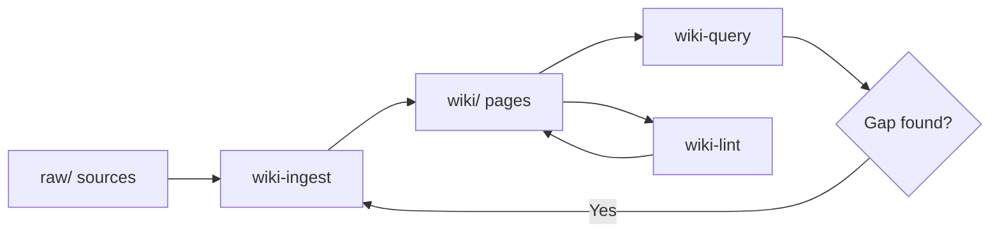

# Wiki Skills Guide

AI-maintained organizational knowledge system based on the [LLM Wiki pattern (Karpathy)](https://gist.github.com/karpathy/442a6bf555914893e9891c11519de94f). Three skills manage the lifecycle: ingest sources, query knowledge, and audit health.

**Skills covered:** wiki-ingest, wiki-query, wiki-lint

> **Retrieval engine.** The skills work without setup, but they perform much better when [QMD](https://github.com/tobi/qmd) is installed and the wiki is indexed. QMD provides BM25 + vector + LLM reranking locally, plus per-path context injection that the skills rely on for audience separation (e.g. teaching agents that `raw/` is preserved-but-not-canonical). See [`qmd-setup.md`](./qmd-setup.md) for the one-time owner setup, including the `Qwen3-Embedding-0.6B` model recommendation for non-English wikis.

---

## How it works



- **`raw/`** — Untouched source files (transcripts, PDFs, docs). Never modified.
- **`wiki/`** — Structured knowledge pages with YAML frontmatter, organized by topic.
- **`wiki/index.md`** — Navigable catalog of all pages.
- **`wiki/log.md`** — Append-only history of all operations.
- **`wiki/sources/`** — Summaries linking raw sources to wiki pages.

---

## Scenario A — Ingesting a meeting transcript

A sprint retrospective transcript arrives at `raw/meetings/2025-03-15-sprint-retro.txt`.

```
/wiki-ingest raw/meetings/2025-03-15-sprint-retro.txt
```

**Step 1 — Check index:** `raw/index.md` shows this file is not yet listed. Fresh ingest.

**Step 2 — Read and extract:** The skill reads the full transcript and identifies key points:
- Sprint velocity dropped 20% due to infra blockers
- Three stories were blocked by payment API outage
- Action item: create an incident response runbook
- Team agreed to switch from 2-week to 1-week sprints

**Step 3 — Human confirms:** You approve the key points and ask to emphasize the incident response runbook.

**Step 4 — Create/update wiki pages:**
- Update `wiki/ops/sprint-cadence.md` (sprint length change)
- Update `wiki/data/blocked-stories.md` (payment API blockers)
- Create `wiki/ops/incident-response-runbook.md` (new page)

**Step 5 — Create source summary:** `wiki/sources/2025-03-15-sprint-retro.md` with frontmatter, key points, and links to affected pages.

**Step 6 — Update indexes:** Mark source as ingested in `raw/index.md`, add entries to `wiki/index.md`, prepend to `wiki/log.md`.

---

## Scenario B — Querying knowledge (answer found)

A new developer asks: "How does the payment flow work?"

```
/wiki-query How does the payment flow work, from checkout to confirmation?
```

**Step 1 — Consult index:** The skill reads `wiki/index.md` and locates `wiki/apps/payment-flow.md` and `wiki/data/payment-schema.md`.

**Step 2 — Read and synthesize:**
- Checkout initiates via `PaymentService.createCharge()` → [payment-flow.md]
- Webhook from gateway confirms or fails → [payment-monitoring.md]
- Charge records stored in `charges` table → [payment-schema.md]

**Step 3 — Evaluate lasting value:** This synthesizes three pages in a novel way. The skill offers to save as a cross-cutting summary.

**Human declines** — it's a one-time question. No wiki update.

---

## Scenario C — Querying reveals a knowledge gap

Someone asks about the incident response escalation matrix.

```
/wiki-query What is the incident response escalation matrix?
```

**Step 1 — Search:** No dedicated page found. Only a brief mention in `wiki/ops/sprint-cadence.md`.

**Step 2 — Report the gap:** "The wiki does not contain a dedicated incident response escalation page."

**Step 3 — Suggest sources:** "Consider ingesting the incident response runbook or PagerDuty configuration to cover this gap."

No wiki update — the skill only surfaces the gap and suggests what to ingest.

---

## Scenario D — Query uncovers contradictions

A PM asks about the data retention policy.

```
/wiki-query What is our data retention policy?
```

Two relevant pages found:
- `wiki/business/data-privacy.md` says **90-day** retention
- `wiki/ops/data-retention.md` says **60-day** retention

The skill presents both viewpoints with a clear warning:
> These pages contradict each other. Clarification needed.

**Suggested fix:** Re-ingest the latest policy document with `/wiki-ingest` to resolve the contradiction.

---

## Scenario E — Re-ingesting an updated source

The meeting transcript at `raw/meetings/2024-12-10-planning.txt` was already ingested but has been updated with additional notes.

```
/wiki-ingest raw/meetings/2024-12-10-planning.txt
```

**Step 1 — Check index:** `raw/index.md` shows this source is already ingested.

**Step 2 — Compare:** Read the source and the existing summary at `wiki/sources/2024-12-10-planning.md`. Find gaps — a billing module scope change was added.

**Step 3 — Diagnose:**
```
## Re-ingest: Sprint Planning 2024-12-10
### Gaps found
- Billing module scope change (API-versioned endpoints) not captured
### Pages to update
- wiki/apps/billing-module.md
```

**Step 4 — Human approves.** The billing module page and source summary are updated.

**Step 5 — Update indexes and log.**

---

## Scenario F — Full wiki health audit

After a month of ingests by multiple team members, the wiki may have drifted.

```
/wiki-lint
```

The skill runs the full checklist:

| Check | Found | Action |
|-------|-------|--------|
| Broken cross-ref in checkout.md | `[billing API](./billing-api.md)` points to missing file | **Auto-fix:** created stub page |
| Orphan page | `wiki/data/experimental-flags.md` not in index | **Auto-fix:** added to index |
| Missing frontmatter | `wiki/ops/deployment.md` lacks `tags:` and `status:` | **Auto-fix:** filled defaults |
| Source inconsistency | `raw/index.md` marks all-hands as ingested, but summary missing | **Pending:** re-ingest or remove? |
| Missing cross-ref | data-privacy.md mentions "incident response" without linking | **Suggested:** add link (not auto) |
| Contradiction | Privacy says 90 days, operations says 60 days | **Auto-fix:** flagged with warning on both pages |
| Stale content | legacy-import.md not updated in 90+ days | **Auto-fix:** marked as stale |

**Report to human:**
- 7 issues found, 5 auto-fixed, 2 pending decisions
- **Decision needed:** Re-ingest the all-hands meeting or remove from index?
- **Decision needed:** Which retention period is correct (90 vs 60 days)?

**Log entry** prepended to `wiki/log.md`.

---

## Scenario G — Focused lint (cross-refs only)

After a large ingest, you only want to check links.

```
/wiki-lint just the links
```

Found 2 broken links. Auto-fix: created stub pages. Done.

---

## Rules

- **Never modify `raw/` files** — sources stay untouched
- **One source at a time** unless explicitly asked for batch
- **Complete YAML frontmatter** on every wiki page (title, audience, sources, updated, tags, status)
- **Flag contradictions explicitly** — don't silently overwrite
- **Always update all three indexes** after ingest: `raw/index.md`, `wiki/index.md`, `wiki/log.md`
- **Simple fixes are automatic** (broken links, missing frontmatter, stale flags)
- **Content decisions need human approval** (delete orphan page, resolve contradiction, add cross-refs)

---

## Chaining

```
/wiki-ingest → /wiki-query → /wiki-lint
```

- **Ingest** adds knowledge. Run when new sources arrive.
- **Query** retrieves knowledge. Run when you need answers.
- **Lint** audits health. Run periodically after batches of ingests.

A query that reveals a gap suggests an ingest. A lint that finds missing sources suggests an ingest. An ingest runs a focused lint on touched pages automatically.
