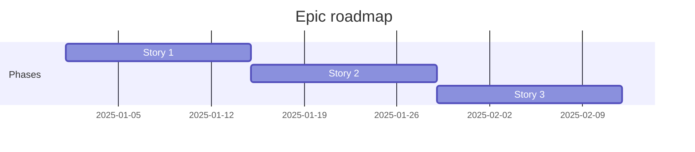

# Epic: <Title>

**Origin:** `planning/<initiative>/intake.md`

## Traceability
- Prototype routes/screens:
- Business rules:
- Source docs:

## Context
- Macro problem:
- Initiative objective:
- Expected business/technical outcome:
- Constraints, assumptions, and references:

### AS-IS
-

### TO-BE
-

### Out of scope
-

## Story backlog

### Story 1: <Name>
**Size:** medium | **Status:** [ ] Not started | **Depends on:** --

**Objective:**

**Traceability:**
- Prototype:
- Business rules:

**Acceptance criteria:**
- [ ]

---

### Story 2: <Name>
**Size:** medium | **Status:** [ ] Not started | **Depends on:** Story 1

(same structure)

## Epic roadmap

## Epic acceptance criteria
- [ ]
- [ ]

## Risks

| Risk | Mitigation |
|---|---|
| risk 1 | mitigation 1 |

## Recommended next step
- `/agile-story` to create the execution plan for the first story

<!-- Save as: planning/<initiative>/epics/NN-<epic>/00-overview.md -->
<!-- Each story becomes: planning/<initiative>/epics/NN-<epic>/NN-story-name.md -->
