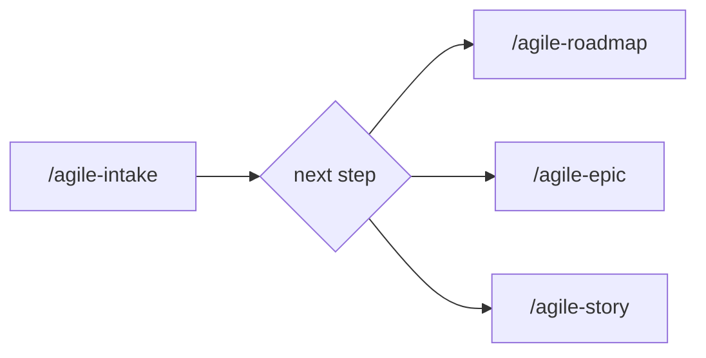

# Intake

Use this skill to transform vague problems, initial ideas, or unstructured requests into clear, actionable intake documents.

Initial context received via slash: $ARGUMENTS

If `$ARGUMENTS` is filled (e.g., file path, text, issue reference, URL), use as starting point for the intake.
If empty, start by asking for a short description of the problem.

## Language

Write the artifact in the user's language. Apply correct grammar and any required diacritics or script-specific characters. If the user's language is unclear, ask before generating output. Templates are in English — translate headers and content to match.

## Project root

This skill writes artifacts at paths relative to the **project root** (the repo where the work happens), not the agent's current working directory.

- If invoked from inside the project, use the relative paths shown in this skill (e.g., `planning/<initiative>/intake.md`).
- If invoked from another directory (e.g., a sibling repo, or when the project lives elsewhere), prepend `<project-root>/` to every artifact path.
- When the project root is ambiguous, confirm with the user via the harness question tool before writing.

## Prompting

Follow the project-wide convention in `CLAUDE.md` / `AGENTS.md` ("Skill Prompting Conventions"). Use the harness's structured-question tool — `AskUserQuestion` (Claude Code), `ask_user_question` (Codex), or `question` (OpenCode) — for the decision points below. Use free-form text only where a path/name/value cannot be enumerated.

| Decision point | Why structured | Suggested options |
|---|---|---|
| Next artifact in the flow | Branches the chain | /agile-roadmap · /agile-epic · /agile-story |
| Save the intake | Hard-to-undo write | Save · Present inline only |

Free-form prompts (no structured tool):

- Initiative name (kebab-case slug)
- Problem description and constraints

No-pause mode: if the user has explicitly disabled mid-skill clarification, convert every structured prompt into an entry under *Open questions* (or equivalent) and proceed without blocking.

## Objective

- Make the problem or opportunity explicit before planning
- Identify constraints, premises, and open questions
- Define the next step in the flow: `/agile-roadmap`, `/agile-epic`, or `/agile-story`
- Avoid work starting without clarity about what is being solved

## When to use

- Someone brings an idea, need, or problem without defined scope
- The request is too vague to become an epic or task directly
- There is uncertainty about size, priority, or approach
- It is the first contact with a new problem

## When NOT to use

- The problem is already clear and scope is defined — use `/agile-epic` or `/agile-story` directly
- The work has already been decomposed — go to `/agile-epic` or `/agile-story`
- It's a trivial fix — use `/agile-story` directly

## Intake process

### 1. Listen and record

Ask the user:

- What is the problem or opportunity?
- Who is affected and how?
- Is there urgency or deadline?
- What constraints are already known?

Don't assume answers. If the user doesn't know, register as an open question.

### 2. Structure the intake

Fill in the template with collected information:

- Context: problem, initial objective, value signal, constraints
- Initial scope: what is included and what is not (even if provisional)
- Inputs and references: stakeholders, documents, technical context
- Open questions: everything that doesn't have an answer yet

**Value signal — exploratory/sample projects:** if the project is exploratory, a sample, or a learning exercise, mark *Expected value signal* as **N/A — exploratory** rather than inventing aspirational numbers. Real product metrics belong to real product work; sample projects do not need KPIs.

**Assumption vs Open question:** an *assumption* is a decision logged for review (the agent took it, the user can override later). An *open question* is a pending decision that would block the next artifact if not resolved. Use the slots accordingly.

### 3. Define next step

Based on trajectory complexity (not duration):

- **Multi-phase trajectory with dependencies** (regardless of total duration) → `/agile-roadmap` → then `/agile-epic`
  Indicators — if 2+ apply, use roadmap:
  - Multiple initiatives that need sequencing (can't run all in parallel)
  - Decisions today affect future decisions (local optimization can become tech debt)
  - Stakeholders need to see the whole journey before approving individual steps
  - External dependencies (other teams, vendors, deadlines)
  - Total complexity exceeds what fits in a single epic
- **Single coordinated initiative** with broad scope → `/agile-epic`
- **Medium problem** with reasonable scope → `/agile-epic` (to decompose into stories)
- **Small and clear problem** → `/agile-story`

> **Important:** Roadmap is not defined by time horizon (e.g., "3-12 months"). A 4-week initiative with 5 distinct phases and critical ordering also benefits from a roadmap. The criterion is trajectory complexity, not duration.

Register the recommendation in the intake and confirm with the user.

> **Flow rule:** For large or complex items, decomposition via `/agile-epic` is mandatory before execution. Only small, localized items can skip directly to `/agile-story`.

### 4. Save the intake

- Ask for the initiative name (e.g., `component-tests`, `auth-refactor`, `mvp-reserva`). Pick a **kebab-case slug** describing the initiative (not the artifact). Avoid sequential numbers, dates, or labels like `intake-1`; pick a slug stable enough to survive scope evolution.
- Save at `planning/<initiative>/intake.md`
- If the user prefers not to save, present inline

### 5. Chain

After user confirmation, offer to generate the next artifact following the official flow:

- Multi-phase trajectory → "Do you want me to create the `/agile-roadmap`?"
- Single coordinated initiative → "Do you want me to run `/agile-epic` to decompose into stories?"
- Small/clear → "Do you want me to create the `/agile-story`?"

### 6. Validate

Before closing the intake, confirm:

- [ ] The problem is clear enough for the next step
- [ ] Constraints and premises have been made explicit
- [ ] The next artifact in the flow has been defined

## Rules

- Never jump straight to implementation from an intake. The intake generates the next artifact, not code.
- If the user insists on starting without clarity, register the risks and ask if they want to proceed anyway.
- The intake should be short — 10 to 15 minutes of conversation maximum. If it takes longer, the problem probably needs `/agile-epic` decomposition.
- Keep the tone of discovery, not detailed planning.

## Template

Use `templates/intake.md` from this skill as base for the artifact.

## Relationship with the flow

This skill is the entry point of the flow. It captures the problem and directs to the correct skill. For guidance on which skill to use, you can also use `/agile-router`.
