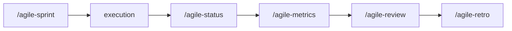

# Sprint Review

Use this skill to consolidate sprint deliveries into a clear, objective review/demo format for stakeholders.

## Language

Write the artifact in the user's language. Apply correct grammar and any required diacritics or script-specific characters. If the user's language is unclear, ask before generating output. Templates are in English — translate headers and content to match.

## Project root

This skill writes artifacts at paths relative to the **project root** (the repo where the work happens), not the agent's current working directory.

- If invoked from inside the project, use the relative paths shown in this skill.
- If invoked from another directory (e.g., a sibling repo, or when the project lives elsewhere), prepend `<project-root>/` to every artifact path.
- When the project root is ambiguous, confirm with the user via the harness question tool before writing.

## Prompting

Follow the project-wide convention in `CLAUDE.md` / `AGENTS.md` ("Skill Prompting Conventions"). Use the harness's structured-question tool — `AskUserQuestion` (Claude Code), `ask_user_question` (Codex), or `question` (OpenCode) — for the decision points below. Use free-form text only where a path/name/value cannot be enumerated.

| Decision point | Why structured | Suggested options |
|---|---|---|
| Audience | Shapes the demo content | Team-only · Stakeholders · Mixed |
| Demo scope | Branches the artifact | Done items only · Include in-progress |

Free-form prompts (no structured tool):

- Stakeholder names
- Demo narration text

No-pause mode: if the user has explicitly disabled mid-skill clarification, convert every structured prompt into an entry under *Open questions* (or equivalent) and proceed without blocking.

## Objective

- Consolidate what was delivered in the sprint
- Compare deliveries against sprint planning commitment
- Highlight scope changes, deviations, and decisions made
- Prepare objective demonstration of delivered value
- Collect stakeholder feedback to feed the next cycle

## When to use

- At the end of a sprint, before retro
- When stakeholders need to see the result of deliveries
- When it is necessary to validate that the product is on the right track
- To close the cycle between sprint planning and retrospective

## Process

### 1. Consolidate deliveries

Gather information from:

- Issues completed in the sprint
- Status closure reports generated
- Status checkpoints and consolidation reports from the period
- Registered scope changes

For each delivered item, register:
- What was expected (from sprint planning)
- What was actually delivered
- Relevant deviations (if any)

### 2. Prepare demonstration

Organize the demo by business value, not technical order:

- Start with impact: "now the team can do X"
- Show the flow working, not slides
- If there is relevant technical part (performance, security), include as context

### 3. Identify undelivered items

For each planned item that was not delivered:
- Reason: blocker, priority change, scope larger than expected
- Destination: returns to backlog, enters next sprint, was discarded

### 4. Collect feedback

Register stakeholder questions and feedback:
- Necessary adjustments
- New needs identified
- Priority changes

### 5. Generate artifact

Use the template below to document the review.

## Template

Use `templates/review.md` from this skill as base for the artifact.

## Rules

- The review shows what *was delivered*, not what *is in progress*. For status of work in progress, use `/agile-status`.
- Be honest about what was not delivered and why. Hiding cut items breaks trust.
- The demo must be verifiable — stakeholders must be able to confirm the result is real.
- Collected feedback must become backlog item or action, never just meeting notes.
- The sprint review feeds the retro. If the review doesn't happen, the retro loses important inputs.

## Relationship with the flow

In the stitched flow, the sprint review connects execution to feedback: planning -> execution -> status -> metrics -> review -> retro.

For status tracking during the sprint, use `/agile-status`. For quantitative data, use `/agile-metrics`.
