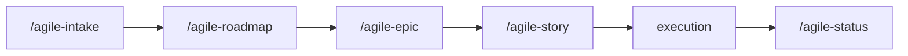

# Roadmap Planning

Use this skill to transform broad objectives into clear, prioritized roadmaps connected to the executable backlog.

Initial context received via slash: $ARGUMENTS

If `$ARGUMENTS` is filled, use as starting point (e.g., intake, initiative list, period).
If empty, ask for the roadmap objective.

## Language

Write the artifact in the user's language. Apply correct grammar and any required diacritics or script-specific characters. If the user's language is unclear, ask before generating output. Templates are in English — translate headers and content to match.

## When to use

Roadmap is defined by **trajectory complexity**, not by duration. Use this skill when 2+ apply:

- Multiple initiatives/phases need sequencing (can't all run in parallel)
- Decisions today affect future decisions (local optimization can become tech debt)
- Stakeholders need to see the whole journey before approving individual steps
- External dependencies (other teams, vendors, deadlines)
- Total complexity exceeds what fits in a single epic

A 4-week initiative with 5 sequenced phases **also benefits** from a roadmap — don't dismiss it as "too short".

## When NOT to use

- Isolated, self-contained initiative (single epic covers it)
- Single epic with no ramifications — go straight to `/agile-epic`
- Team already has the trajectory clear in mind and no stakeholder needs the map

## Scope (types of roadmap)

- **Trajectory roadmap:** multi-phase initiative with dependencies between phases (any duration)
- **Initiative roadmap:** phases, stories, unblocks, and delivery order for a named initiative
- **Quarterly roadmap:** direction alignment, period objectives, and macro priorities (one specific type — not the only one)

## Operating rules

- Roadmap must focus on results and capabilities, not extensive technical lists.
- Every roadmap item must indicate expected value, dependencies, and progress signal.
- The roadmap must show what is a commitment, what is a risk, and what is outside the period.
- Whenever possible, each initiative should point to a corresponding epic.

## How to build a trajectory roadmap (default)
1. Declare the overarching objective of the journey.
2. List 2-5 phases or initiatives (sequenced or parallel).
3. Order by dependency and value — make sequencing explicit.
4. For each phase: expected outcome, dependencies, progress signal, risks.
5. Register what is a commitment, what is a risk, and what is out of scope.
6. Validate that the narrative is observable and stakeholder-ready.

## How to build a quarterly roadmap (specific type)
Same as above, with period objective (quarter) as the time boundary.
Use when stakeholders expect a period-based view (common for product/exec audiences).

## How to build a roadmap by epic
1. Declare the epic objective.
2. Define phases or delivery waves.
3. Relate stories by phase.
4. Make unblocks, risks, and intermediate validations explicit.
5. Confirm that the roadmap guides execution without replacing plans.

## Where to save

- Initiative/trajectory roadmap: `planning/<initiative>/roadmap.md`
- Quarterly roadmap: `planning/roadmaps/Q<N>-YYYY.md`

## Collaborative work

When the team has 2+ developers, the roadmap should:
- Identify parallel tracks (e.g., Backend, Frontend, AI Engineering) so devs can work simultaneously
- Define interface contracts between tracks to minimize blocking
- Show which stories/phases can run in parallel in the timeline
- Ask about team size and composition during roadmap creation

## Chaining

At the end of the roadmap, offer **only** `/agile-epic`:
- "Do you want me to run `/agile-epic` to decompose the first initiative into stories?"

> **Important:** The roadmap identifies initiatives at a macro level. Each initiative should be decomposed via `/agile-epic` before execution.

## Template

Use `templates/roadmap.md` from this skill as base.

## Relationship with the flow

This skill connects strategy and execution. For decomposition, use `/agile-epic`. For execution planning, use `/agile-story`.
