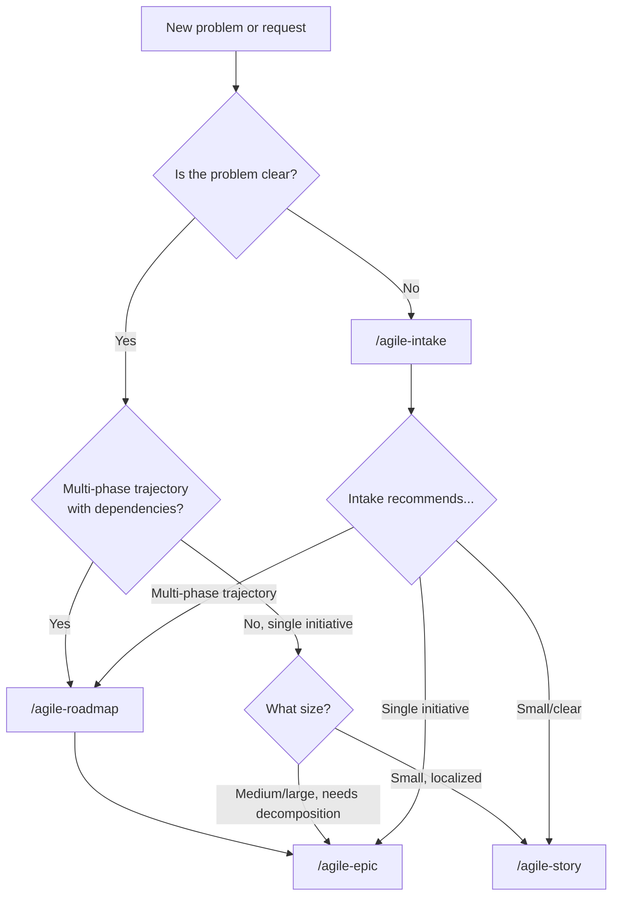
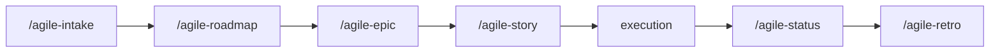

# Router

Use this skill to decide which agile skill is appropriate and get directed to the correct one.

Initial context received via slash: $ARGUMENTS

If `$ARGUMENTS` is filled, use as context to determine the right skill.
If empty, ask the user what they need help with.

## Scope

This skill replaces both the planning router and the ceremonies router. It covers three areas:

| Area | Question | Skills |
|---|---|---|
| What to create | What planning artifact fits this work? | `/agile-intake`, `/agile-roadmap`, `/agile-epic`, `/agile-story` |
| What ceremony to run | Where are we in the sprint cycle? | `/agile-sprint`, `/agile-review`, `/agile-retro` |
| What to track | How should I report progress? | `/agile-status` (checkpoint, consolidation, closure) |
| What to improve in the process | Did real usage expose a skill/template gap or overlap? | `/agile-skill-feedback` |

## Decision tree

### Planning: What artifact do I need?

> **Note on `/agile-roadmap`:** Roadmap is NOT defined by time horizon (e.g., "3-12 months"). It is defined by **trajectory complexity**. Even a 4-week initiative benefits from a roadmap if it has multiple sequenced phases with dependencies between them.

> **Note on `/agile-epic`:** Handles both the epic overview and story decomposition. There is no separate story skill. Medium work that needs richer acceptance criteria goes through `/agile-epic` for structure, or directly to `/agile-story` if it's a single vertical delivery.

### Ceremonies: Where am I in the cycle?

- **Starting a sprint?** → `/agile-sprint`
- **Sprint just ended?** → `/agile-review` (demo deliveries) then `/agile-retro` (reflect on process)
- **Backlog items unclear?** → `/agile-epic` (decompose) or run `/agile-refinement` (validate)
- **Need metrics?** → `/agile-metrics` (before review or retro)
- **A skill/template caused friction or overlaps with another?** → `/agile-skill-feedback`

### Tracking: How do I report progress?

- **Quick daily checkpoint?** → `/agile-status` (checkpoint mode)
- **Period or milestone consolidation?** → `/agile-status` (consolidation mode)
- **Delivery finished?** → `/agile-status` (closure mode)
- **Skill library needs merge, split, deprecation, removal, or template refinement?** → `/agile-skill-feedback`

## Light sizing

> **Internal reference for AI agent — not exposed to users.** Use plain language when communicating the recommendation.

| Size | Description | Artifact | Skill |
|---|---|---|---|
| Extra small | Localized adjustment, 1 file, low risk | Task | `/agile-story` |
| Small | Small delivery, few files, simple validation | Task | `/agile-story` |
| Medium | Vertical delivery, several files, moderate validation | Epic story file or Task | `/agile-epic` or `/agile-story` |
| Large | Multiple coordinated stories, needs decomposition | Epic | `/agile-epic` |
| Extra large | Multi-story initiative, coordination needed | Epic | `/agile-epic` |

## When to use roadmap vs epic

Sizing alone is not enough to decide between roadmap and epic. Use this checklist:

**Use `/agile-roadmap` when 2+ apply** (regardless of duration):
- Multiple initiatives need sequencing (can't all run in parallel)
- Decisions today affect future decisions (local optimization can become tech debt)
- Stakeholders need to see the whole journey before approving individual steps
- External dependencies (other teams, vendors, deadlines)
- Total complexity exceeds what fits in a single epic

**Use `/agile-epic` when**:
- Single coordinated initiative with clear scope
- Can be broken into stories without needing a parent plan
- Fits on one delivery wave (no distinct phases with different goals)

> **Anti-pattern:** Assume roadmap = "long-term strategic plan". A 4-week work with 5 phases and hard ordering also benefits from a roadmap. The criterion is **trajectory complexity**, not duration.

## Process

1. Listen to the user's context.
2. Determine which area applies: planning, ceremony, or tracking.
3. Apply the decision tree for that area.
4. Recommend the specific skill with a brief explanation.
5. Confirm with the user before they proceed.

## Rules

- This is a router skill — it evaluates and directs, but does not produce artifacts.
- If the problem isn't clear, suggest `/agile-intake` before routing.
- Use plain language when explaining the recommendation. Do not reference size codes.
- Always confirm the recommendation with the user.

## Available skills

| Skill | Purpose |
|---|---|
| `/agile-intake` | Capture vague problems |
| `/agile-roadmap` | Map multi-phase trajectories with dependencies (any duration) |
| `/agile-epic` | Structure initiatives, decompose into stories |
| `/agile-story` | Execution plan for localized changes |
| `/agile-refinement` | Validate planning artifacts and review code |
| `/agile-status` | Track progress (checkpoint, consolidation, closure) |
| `/agile-sprint` | Sprint planning ceremony |
| `/agile-review` | Sprint review and demo |
| `/agile-metrics` | Quantitative sprint metrics |
| `/agile-retro` | Retrospective with improvement actions |
| `/agile-proto` | Interactive UI prototypes |
| `/agile-onboarding` | New team member onboarding |
| `/agile-skill-feedback` | Improve, merge, split, deprecate, or remove skills from real usage evidence |
| `/agile-router` | This skill — guidance on which skill to use |

## Relationship with the flow

This skill is a router. It evaluates and directs, but does not produce the final artifact. For specific work, use the recommended skill directly.
