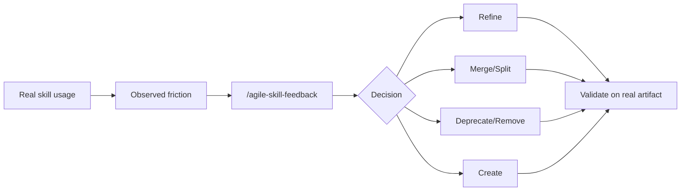

# Skill Feedback

Use this skill to improve the skill library from real delivery evidence. It is for process maintenance, not generic brainstorming.

Initial context received via slash: $ARGUMENTS

If `$ARGUMENTS` is filled, use it as the observed case, artifact path, diff, or feedback note. If empty, ask for the observed problem and the skill involved.

## Language

Write the artifact in the user's language. Apply correct grammar and any required diacritics or script-specific characters.

## Objective

- Capture what happened during real use of a skill
- Decide whether the right action is refine, merge, split, deprecate, remove, or create
- Keep skill changes small, traceable, and validated against realistic artifacts
- Prevent the process library from growing by inertia

## When to use

- A skill or template did not support a real project workflow
- Two skills overlap or are always used together with duplicated output
- A skill is confusing, stale, rarely useful, or too broad
- A template is missing required fields or creates weak artifacts
- TDD, refinement, sprint planning, retro, or status work exposes missing guidance
- A product wants to generate a proposed patch to the skill library

## When NOT to use

- Creating a normal planning artifact -- use the appropriate agile skill
- Reviewing application code -- use `/agile-refinement`
- Running a sprint retrospective -- use `/agile-retro`
- Creating a general-purpose skill from scratch with no agile/process feedback -- use the platform skill creator

## Inputs to collect

- Observed case: project, artifact, story, sprint, PR, or session
- Skill/template affected
- Trigger that selected the skill, if known
- Expected behavior
- Actual friction or failure
- Evidence: artifact path, diff, test, review finding, user correction, repeated manual step
- Impact: confusion, rework, missed validation, bad output, duplicated process, context cost

## Decision rules

### Refine

Use when the skill is right but instructions, template fields, examples, or validation need adjustment.

### Merge

Use when two skills have overlapping triggers, are frequently chained with duplicated outputs, and do not need distinct artifacts or validation gates.

### Split

Use when one skill handles multiple responsibilities with different audiences, templates, risks, or validation needs.

### Deprecate or remove

Use when a skill has little real use, causes routing confusion, duplicates another skill, or preserves process that no longer helps. Prefer deprecation before removal if installed users may still depend on it.

### Create

Use only when a recurring workflow has no good home in existing skills and has concrete examples.

## Process

1. Read the affected `SKILL.md` and only the relevant local template/reference files.
2. Inspect the evidence artifact or diff.
3. Classify the action: refine, merge, split, deprecate, remove, or create.
4. Fill `templates/skill-feedback.md`.
5. Propose the smallest viable change.
6. Define validation: which artifact, prompt, test, or review will prove the change works.
7. Require human approval before applying workflow changes that affect a team.

## Rules

- Do not create a new skill if a concise change to an existing skill solves the problem.
- Do not merge skills just because they are adjacent; merge only when outputs and validation are truly redundant.
- Keep `SKILL.md` concise. Move reusable detail into local `templates/`, `references/`, or `scripts/` only when needed.
- Templates must live inside the skill folder under `templates/`.
- Preserve auditability: record source skill version or commit when available.
- For AI-generated patches, include the model/provider and the approval status in the feedback artifact when known.

## Template

Use `templates/skill-feedback.md` as the base artifact.

## Relationship with the flow

This skill closes the process feedback loop. It should be used after real work exposes a gap, not as a substitute for doing the work.
