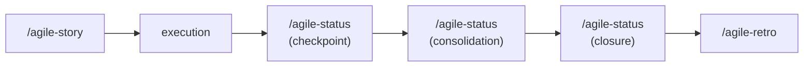

# Status

Use this skill to track delivery progress. It adapts to what the user needs: a quick checkpoint, a period consolidation, or a delivery closure.

Initial context received via slash: $ARGUMENTS

If `$ARGUMENTS` is filled (e.g., initiative name, issue, plan reference, "daily", "report", "close"), use as starting point.
If empty, ask the user what they need: a checkpoint, a consolidation, or a closure.

## Language

Write the artifact in the user's language. Apply correct grammar and any required diacritics or script-specific characters. If the user's language is unclear, ask before generating output. Templates are in English — translate headers and content to match.

## Project root

This skill writes artifacts at paths relative to the **project root** (the repo where the work happens), not the agent's current working directory.

- If invoked from inside the project, use the relative paths shown in this skill.
- If invoked from another directory (e.g., a sibling repo, or when the project lives elsewhere), prepend `<project-root>/` to every artifact path.
- When the project root is ambiguous, confirm with the user via the harness question tool before writing.

## Prompting

Follow the project-wide convention in `CLAUDE.md` / `AGENTS.md` ("Skill Prompting Conventions"). Use the harness's structured-question tool — `AskUserQuestion` (Claude Code), `ask_user_question` (Codex), or `question` (OpenCode) — for the decision points below. Use free-form text only where a path/name/value cannot be enumerated.

| Decision point | Why structured | Suggested options |
|---|---|---|
| Mode | Picks template + flow | Checkpoint · Consolidation · Closure |
| Chaining next step (per-story closure) | Branches the next action | Next /agile-story · Consolidation later · None |
| Chaining next step (cycle-end closure) | Branches the next action | /agile-retro · /agile-metrics · /agile-review |

Free-form prompts (no structured tool):

- Blocker descriptions
- Progress narration

No-pause mode: if the user has explicitly disabled mid-skill clarification, convert every structured prompt into an entry under *Open questions* (or equivalent) and proceed without blocking.

## Objective

- Track real progress against a plan, story, or epic
- Make blockers explicit with impact, owner, and next action
- Consolidate deliveries, deviations, and risks for a period
- Formally close deliveries with verification and handoff
- Maintain traceability with the active plan or issue

## Modes

### Checkpoint (was `/daily`)

Quick status update — progress, blockers, next step. Under 5 minutes.

**When to use:**
- Daily or session-level progress update
- A blocker surfaced and needs to be made explicit
- Mid-task checkpoint

**Process:**
1. Identify the active plan, story, or issue.
2. Record what advanced since the last cycle.
3. Record blockers with impact, owner, and next action.
4. Define the next observable step.

**Where to save:**
- Present inline by default (checkpoints are short)
- If the user asks to save: `planning/<initiative>/status/YYYY-MM-DD.md`

### Consolidation (was `/status-report`)

Period or milestone summary — what was completed, deviations, risks, decisions needed.

**When to use:**
- Stakeholders ask "where are we?" on an initiative
- Mid-epic or mid-sprint consolidated view
- Weekly/biweekly status summary
- Before a sprint review, to prepare the status snapshot

**Process:**
1. Define the report scope (period, milestone, initiative).
2. Collect data from checkpoints, plans, epic/stories, and git log.
3. Consolidate: completed, in progress, deviations, risks, decisions needed.
4. Define next steps with owners.

**Where to save:**
- `planning/<initiative>/status/report-YYYY-MM-DD.md`
- Or present inline if it's a short report

### Closure (was `/post-impl`)

Formal delivery closure — plan vs result, verification, remaining risks, handoff.

**When to use:**
- A plan, story, or epic has been completed
- Before moving to the next delivery
- Before a retro, to create an objective record

**Process:**
1. Identify the delivery being closed (plan, story, epic).
2. **Surface scope drift before drafting.** Run `git diff` (or equivalent) against the story's acceptance criteria. Explicitly list any change that does not map to an acceptance bullet, with the rationale per change. Catches drift at write-time, not retrospectively.
3. Compare plan vs result: what was delivered, what remained pending, scope changes.
4. Execute verifications: lint, typecheck, tests, manual validation. Record actual results.
5. Record remaining risks and next steps.
6. Define handoff (who needs to know).

**Scope of closure (affects chaining):**
- **Per-story closure** — single story complete inside an ongoing epic/sprint. Do **not** trigger `/agile-retro`; recommend the next `/agile-story` or a consolidation later.
- **Cycle-end closure** — epic complete, sprint ended, or initiative finished. Recommend `/agile-retro` and `/agile-metrics`.

**Where to save:**
- `planning/<initiative>/status/<mode>-YYYY-MM-DD-<slug>.md` — `<slug>` disambiguates multiple closures on the same day (e.g., `closure-2026-05-12-story-01.md`).
- If standalone plan: present inline

## How to decide the mode

- **Need a quick checkpoint?** → Checkpoint mode
- **Need to consolidate a period or milestone?** → Consolidation mode
- **Delivery finished and needs to be closed?** → Closure mode
- **Not sure?** Ask the user for context and suggest the appropriate mode.

## Chaining

- Checkpoint: if critical blocker → escalate or adjust the plan. If delivery closing → switch to closure mode.
- Consolidation: if period closed a delivery → suggest closure mode. If sprint ended → suggest `/agile-review` or `/agile-retro`.
- Closure (per-story): suggest the next `/agile-story` or a consolidation later. Do **not** trigger `/agile-retro` for a single story.
- Closure (cycle-end): suggest `/agile-retro` and `/agile-metrics`. If part of an epic, also update the story status in the epic overview.

## Reference template

Use `templates/status.md` from this skill as base.

## Rules

- Every update must reflect real state, not optimistic intention.
- Blockers must have impact, owner, and next action — not just a description.
- Checkpoints must reference the specific plan, story, or issue for traceability.
- Closure mode must always run lint, typecheck, and tests. Don't assume they pass.
- Report actual results, not intention. If lint failed, say it failed.
- Keep it proportional — a checkpoint should take under 5 minutes, a consolidation under 15.

## Relationship with the flow

This skill handles all delivery tracking. For planning, use `/agile-intake`, `/agile-epic`, or `/agile-story`. For ceremonies, use `/agile-sprint`, `/agile-review`, or `/agile-retro`.
