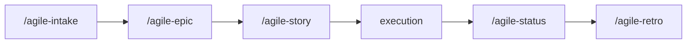

# Story

Use this skill to create a clear execution plan, ready to implement.

Initial context received via slash: $ARGUMENTS

If `$ARGUMENTS` is filled (e.g., story reference, description, issue), use as starting point.
If empty, ask what will be planned.

## Language

Write the artifact in the user's language. Apply correct grammar and any required diacritics or script-specific characters. If the user's language is unclear, ask before generating output. Templates are in English — translate headers and content to match.

## Project root

This skill writes artifacts at paths relative to the **project root** (the repo where the work happens), not the agent's current working directory.

- If invoked from inside the project, use the relative paths shown in this skill.
- If invoked from another directory (e.g., a sibling repo, or when the project lives elsewhere), prepend `<project-root>/` to every artifact path.
- When the project root is ambiguous, confirm with the user via the harness question tool before writing.

## Prompting

Follow the project-wide convention in `CLAUDE.md` / `AGENTS.md` ("Skill Prompting Conventions"). Use the harness's structured-question tool — `AskUserQuestion` (Claude Code), `ask_user_question` (Codex), or `question` (OpenCode) — for the decision points below. Use free-form text only where a path/name/value cannot be enumerated.

| Decision point | Why structured | Suggested options |
|---|---|---|
| Implementation mode | Branches the closing flow | Plan-only (stop after artifact) · Plan-then-implement (continue in this session) |
| Test strategy (when adding companion tests) | Affects file layout | sibling · sibling_dir · tests_root |

Free-form prompts (no structured tool):

- Story name
- Task descriptions
- Stack choices (when not yet locked at epic-time)

No-pause mode: if the user has explicitly disabled mid-skill clarification, convert every structured prompt into an entry under *Open questions* (or equivalent) and proceed without blocking.

## Objective

- Create a clear and proportionally simple execution plan
- Map impacted files
- Define verifiable tasks
- Produce artifact ready for immediate implementation

## When to use

- Small and localized work — few files, low risk, single-cycle delivery
- A story from an epic that needs an operational execution plan
- Story already detailed in an epic that needs tasks mapped to files
- The problem is already clear and you just need to map out what to change

## When NOT to use

- Large work needing decomposition — use `/agile-epic`
- Problem not yet clear — use `/agile-intake`
- Multiple dependent deliveries — use `/agile-epic`
- Need strategic direction — use `/agile-roadmap`

## Process

### 1. Understand what will be done

If coming from an epic story file, read the story and extract:
- Objective
- Impacted files
- Acceptance criteria
- Prototype routes/screens involved
- Business rule IDs/files involved

If standalone, ask the user and explore the code to understand context.

### 2. Build the plan

Fill in the required sections:

- **Context:** problem, objective, constraints
- **Traceability:** prototype routes/screens, business rule IDs/files, source docs
- **Files:** exact paths with action (read/alter/create)
- **Detail:** AS-IS, TO-BE, scope, approach
- **Test-first plan:** behavior to prove, first failing test, test level, and low-value tests to avoid
- **Tasks:** verifiable checklist
- **Verification:** commands and validations

### 3. Present and wait for confirmation

Use the harness's plan-mode tool to present the plan (e.g., `ExitPlanMode` in Claude Code). Wait for explicit confirmation before implementing.

**Implementation mode (decide at this step):**

- **Plan-then-implement (same session):** present the plan, get confirmation, then proceed to write code following the checklist. The default when the user asked for a "story" expecting a code change to follow.
- **Plan-only:** stop after the plan artifact is saved. The default when the story belongs to a planning loop (e.g., decomposing an epic ahead of execution, or running this skill as a sample exercise).

Pick the mode by asking the user via the harness's question tool when the workflow is ambiguous (see `## Prompting`).

### Epic ↔ story boundary

When the story file already exists from `/agile-epic`, this skill **adds execution detail**, it does not rewrite epic-time content:

- Epic-time produces vertical-phase **outlines** in `Tasks`.
- Story-time adds **per-task `Done when:` criteria**, the **`Test-first plan`**, and concrete **verification commands**.
- Story-time may also introduce a **`Story-time decisions`** table inside `Approach` if 2+ implementation choices need to be locked.

## Where to save

- If part of an initiative: `planning/<initiative>/epics/NN-<epic>/NN-story-name.md`
  - When the story file from the epic already exists, add/update the Tasks and Verification sections in place.
- If standalone: `.agents/plans/<name>.md` (for items without an epic)

> Task plans are execution artifacts. They reference their parent story or epic via the Origin field. When part of an initiative, the story file already contains context — the task adds execution detail.

## Cross-reference

If the plan comes from an epic, include at the top:

```
**Origin:** `planning/<initiative>/epics/NN-<epic>/00-overview.md`
```

## Chaining

After plan confirmation:
- **Plan-then-implement:** implement following the checklist; at the end, suggest `/agile-status` (closure mode) to close the delivery.
- **Plan-only:** stop after the plan artifact; suggest invoking this skill again (or `/agile-status` closure) when implementation actually happens.

## Reference template

Use `templates/story.md` from this skill as base.

## Required sections

Every plan must contain:

1. **Context** (problem, objective, constraints, references)
2. **Traceability** (prototype routes/screens, business rule IDs/files, source docs)
3. **Files** (exact paths, action, reason)
4. **Detail** (AS-IS, TO-BE, scope, approach, risks)
5. **Test-first plan** (behavior, first failing test, preferred level, and front-end value check when applicable)
6. **Tasks** (verifiable checklist)
7. **Verification** (lint, typecheck, tests, manual validation, acceptance)

## Rules

- Every plan must be presented before implementation (ExitPlanMode).
- Only implement after explicit user confirmation.
- Don't create a task plan for work that needs an epic (large scope with several stories).
- Files must have exact paths.
- Reference business rule IDs when the story implements domain behavior, permissions, sync, conflict handling, AI approvals, or audit/versioning.
- Front-end plans should cite the prototype route/screen when the change is user-facing.
- Tasks must be verifiable, not vague.
- When completed, update `[ ]` to `[x]` according to actual progress.

## Relationship with the flow



This skill is the last step before execution. For larger problems, use `/agile-epic`. To close the delivery, use `/agile-status` (closure mode).
