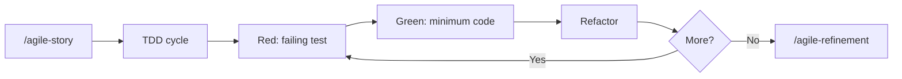

# TDD (Test-Driven Development)

Guide the Red-Green-Refactor cycle and pragmatic testing strategy. "Write tests. Not too many. Mostly integration."

Initial context received via slash: $ARGUMENTS

If `$ARGUMENTS` is filled (e.g., module name, feature description), use as starting point.
If empty, ask what will be tested.

## Language

Write artifacts and test descriptions in the user's language. When in doubt, ask. Test code itself (function names, assertions) stays in English.

## When to use

- Starting a new feature with TDD
- Adding tests to existing code
- Establishing test coverage for a module
- Unclear whether something needs unit, integration, or E2E tests

## When NOT to use

- Quick prototypes where tests add no value -- use `/agile-proto`
- Throwaway scripts
- Pure documentation changes

## TDD cycle

1. **Red** -- write a failing test that describes the desired behavior
2. **Green** -- write the minimum code to make it pass
3. **Refactor** -- improve structure without changing behavior
4. Repeat

Present each step explicitly. Do not skip Red -- the test must fail first.

## Test pyramid (pragmatic)

| Layer | Target | Focus |
|---|---|---|
| Unit | 60% | Pure functions, transformers, utils |
| Integration | 30% | Services, DB interactions, API routes |
| E2E | 10% | Critical user flows |

Overall coverage target: 75%+.

For front-end work, treat these percentages as risk guidance, not quotas. Prefer integration tests that exercise user behavior, validation, local state, API contracts, permissions, offline/sync behavior, and critical flows. Avoid tests that only assert static text, that a button rendered, or implementation details of a design-system component.

When a project keeps business rules in `planning/<initiative>/business/*.md`, use those rule IDs to decide what deserves tests. Tests should prove behavior behind important rules, not restate the rule text.

## File structure

- **Unit:** co-located with source (`foo.test.ts` beside `foo.ts`)
- **Integration/E2E:** `tests/` with `integration/`, `e2e/`, `helpers/`, `fixtures/`, `mocks/`
- **Naming:** `.test.ts` (unit/integration), `.e2e.test.ts` (E2E)
- **Never** `.spec.ts`

## Rules

- AAA pattern (Arrange / Act / Assert)
- One concept per test
- Descriptive names that read as sentences
- **Always** use factories (e.g., `faker`) over hardcoded data
- Isolate with `beforeEach` -- no shared state between tests
- Test behavior, not implementation details

## Anti-patterns (avoid)

- Interdependent tests (test A depends on test B running first)
- Arbitrary `sleep(ms)` -- use proper waits
- Testing private methods -- test through public API
- `console.log` in tests -- use proper assertions
- Order-dependent tests
- Mocking what you own (mock external dependencies, not your own code)

## Coverage targets (granular)

| Area | Target |
|---|---|
| Transformers / pure functions | 90%+ |
| Utils | 85%+ |
| Services | 80%+ |
| Routes / handlers | 70%+ |

## Commands (Bun)

```
bun test
bun test --watch
bun test --coverage
bun test --filter "name"
bun test src/dir/
```

Adjust for other runtimes (vitest, jest) as needed. Detect the project's test runner from `package.json` or config files before suggesting commands.

## Process

### 1. Understand what to test

Explore the code to understand:
- What module or feature needs tests
- What behaviors are critical
- What is already covered (check existing tests)
- Which business rule IDs, acceptance criteria, or prototype flows the change must satisfy

### 2. Choose the right test type

Use the test pyramid as guide:
- Pure function with no side effects? Unit test.
- Service that talks to DB or external API? Integration test.
- Critical user flow that spans multiple systems? E2E test.
- Front-end behavior with validation, API contract, permission, optimistic update, or offline/sync state? Integration test.
- Static copy, simple rendering, or visual-only detail with no rule? Usually no test unless it protects a known regression.

For local-first products, give priority to tests that cover command validation, optimistic state, offline queue persistence, reconciliation, conflict handling, permissions, and audit events.

### 3. Execute the TDD cycle

For each behavior:
1. Write the failing test (Red)
2. Implement the minimum code (Green)
3. Refactor if needed
4. Verify the test still passes

Record the business rule ID or acceptance criterion in the test description or surrounding story artifact when that mapping helps future refinement.

### 4. Verify coverage

Run coverage and check against targets. Fill gaps in critical areas first.

## Chaining

- During feature implementation: work inside the `/agile-story` checklist
- After implementation: `/agile-refinement` to review test quality
- Before closing: ensure tests are part of `/agile-status` (closure mode) verification
- If the TDD workflow exposes repeated friction, missing guidance, weak templates, or unclear verification, capture a concise skill feedback note with the affected skill/template, evidence, proposed change, and validation artifact.
- If repeated TDD friction suggests a skill/template change, use `/agile-skill-feedback` before editing the process library.

## Relationship with the flow



This skill operates during execution. It pairs with `/agile-story` (which defines what to build) and feeds into `/agile-refinement` (which validates the result).
