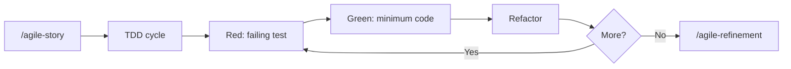

# TDD (Test-Driven Development)

Guide the Red-Green-Refactor cycle and pragmatic testing strategy. "Write tests. Not too many. Mostly integration."

Initial context received via slash: $ARGUMENTS

If `$ARGUMENTS` is filled (e.g., module name, feature description), use as starting point.
If empty, ask what will be tested.

## Language

Write artifacts and test descriptions in the user's language. When in doubt, ask. Test code itself (function names, assertions) stays in English.

## Project root

This skill writes artifacts at paths relative to the **project root** (the repo where the work happens), not the agent's current working directory.

- If invoked from inside the project, use the relative paths shown in this skill.
- If invoked from another directory (e.g., a sibling repo, or when the project lives elsewhere), prepend `<project-root>/` to every artifact path.
- When the project root is ambiguous, confirm with the user via the harness question tool before writing.

## Prompting

Follow the project-wide convention in `CLAUDE.md` / `AGENTS.md` ("Skill Prompting Conventions"). Use the harness's structured-question tool — `AskUserQuestion` (Claude Code), `ask_user_question` (Codex), or `question` (OpenCode) — for the decision points below. Use free-form text only where a path/name/value cannot be enumerated.

| Decision point | Why structured | Suggested options |
|---|---|---|
| Enforcement mode (when installing) | Hard-to-undo policy choice | warn · block · keep current |
| Test strategy (when ambiguous) | Affects file layout | sibling · sibling_dir · tests_root |
| Exempt a specific path | Edits guardrails config | yes · no · review later |

Free-form prompts (no structured tool):

- Test descriptions
- Exemption rationale

No-pause mode: if the user has explicitly disabled mid-skill clarification, convert every structured prompt into an entry under *Open questions* (or equivalent) and proceed without blocking.

## When to use

- Starting a new feature with TDD
- Adding tests to existing code
- Establishing test coverage for a module
- Unclear whether something needs unit, integration, or E2E tests

## When NOT to use

- Quick prototypes where tests add no value -- use `/agile-proto`
- Throwaway scripts
- Pure documentation changes

## TDD cycle

1. **Red** -- write a failing test that describes the desired behavior
2. **Green** -- write the minimum code to make it pass
3. **Refactor** -- improve structure without changing behavior
4. Repeat

Present each step explicitly. Do not skip Red -- the test must fail first.

## Test pyramid (pragmatic)

| Layer | Target | Focus |
|---|---|---|
| Unit | 60% | Pure functions, transformers, utils |
| Integration | 30% | Services, DB interactions, API routes |
| E2E | 10% | Critical user flows |

Overall coverage target: 75%+.

For front-end work, treat these percentages as risk guidance, not quotas. Prefer integration tests that exercise user behavior, validation, local state, API contracts, permissions, offline/sync behavior, and critical flows. Avoid tests that only assert static text, that a button rendered, or implementation details of a design-system component.

When a project keeps business rules in `planning/<initiative>/business/*.md`, use those rule IDs to decide what deserves tests. Tests should prove behavior behind important rules, not restate the rule text.

## File structure

- **Unit:** co-located with source (`foo.test.ts` beside `foo.ts`)
- **Integration/E2E:** `tests/` with `integration/`, `e2e/`, `helpers/`, `fixtures/`, `mocks/`
- **Naming:** `.test.ts` (unit/integration), `.e2e.test.ts` (E2E)
- **Never** `.spec.ts`

## Rules

- AAA pattern (Arrange / Act / Assert)
- One concept per test
- Descriptive names that read as sentences
- **Always** use factories (e.g., `faker`) over hardcoded data
- Isolate with `beforeEach` -- no shared state between tests
- Test behavior, not implementation details

## Anti-patterns (avoid)

- Interdependent tests (test A depends on test B running first)
- Arbitrary `sleep(ms)` -- use proper waits
- Testing private methods -- test through public API
- `console.log` in tests -- use proper assertions
- Order-dependent tests
- Mocking what you own (mock external dependencies, not your own code)

## Coverage targets (granular)

| Area | Target |
|---|---|
| Transformers / pure functions | 90%+ |
| Utils | 85%+ |
| Services | 80%+ |
| Routes / handlers | 70%+ |

## Commands (Bun)

```
bun test
bun test --watch
bun test --coverage
bun test --filter "name"
bun test src/dir/
```

Adjust for other runtimes (vitest, jest) as needed. Detect the project's test runner from `package.json` or config files before suggesting commands.

## Process

### 1. Understand what to test

Explore the code to understand:
- What module or feature needs tests
- What behaviors are critical
- What is already covered (check existing tests)
- Which business rule IDs, acceptance criteria, or prototype flows the change must satisfy

### 2. Choose the right test type

Use the test pyramid as guide:
- Pure function with no side effects? Unit test.
- Service that talks to DB or external API? Integration test.
- Critical user flow that spans multiple systems? E2E test.
- Front-end behavior with validation, API contract, permission, optimistic update, or offline/sync state? Integration test.
- Static copy, simple rendering, or visual-only detail with no rule? Usually no test unless it protects a known regression.

For local-first products, give priority to tests that cover command validation, optimistic state, offline queue persistence, reconciliation, conflict handling, permissions, and audit events.

### 3. Execute the TDD cycle

For each behavior:
1. Write the failing test (Red)
2. Implement the minimum code (Green)
3. Refactor if needed
4. Verify the test still passes

Record the business rule ID or acceptance criterion in the test description or surrounding story artifact when that mapping helps future refinement.

### 4. Verify coverage

Run coverage and check against targets. Fill gaps in critical areas first.

## Chaining

- During feature implementation: work inside the `/agile-story` checklist
- After implementation: `/agile-refinement` to review test quality
- Before closing: ensure tests are part of `/agile-status` (closure mode) verification
- If the TDD workflow exposes repeated friction, missing guidance, weak templates, or unclear verification, capture a concise skill feedback note with the affected skill/template, evidence, proposed change, and validation artifact.
- If repeated TDD friction suggests a skill/template change, use `/agile-skill-feedback` before editing the process library.

## Enforcement (optional, opt-in per project)

Beyond advisory guidance, this skill ships hook templates that turn the TDD rule into a project-level guardrail. When a project enables them, every implementation session is checked at the file-write level — without the agent having to remember to invoke this skill.

### What gets enforced

- **PreToolUse on `Write|Edit|MultiEdit`** — if the target file matches `source_paths` in `.tdd-guardrails.yml` and a companion test does not exist, the hook warns (`mode: warn`) or blocks the tool call (`mode: block`).
- **Stop hook** — at session end, scans the git diff and reports source files touched without a companion test.
- **SessionStart hook** — announces "TDD enforcement active" so the agent knows the rule is in force.

The hook templates live at `skills/agile-tdd/templates/hooks/*.sh.tmpl` and the config schema at `skills/agile-tdd/templates/tdd-guardrails.yml.tmpl`.

### Config (`.tdd-guardrails.yml`)

| Key | Meaning |
|---|---|
| `enabled` | Global on/off |
| `mode` | `warn` (stderr only) or `block` (PreToolUse rejects the call) |
| `source_paths` | Globs that require a companion test |
| `test_strategy` | `sibling` (`foo.ts` → `foo.test.ts`), `sibling_dir` (`__tests__/foo.test.ts`), or `tests_root` (`<app>/tests/integration/foo.test.ts`) |
| `exemptions` | Globs allowed without a test (entry points, generated files, UI primitives) |

**Pattern semantics:** the hook scripts use **bash `case` globs**, not extended globstar. In bash `case` patterns, `*` matches any sequence of characters including `/`; there is **no** `**`. So `apps/*/src/*.ts` matches both `apps/server/src/handler.ts` and `apps/server/src/auth/handler.ts`. Do not use `**` in `source_paths` or `exemptions`.

### Enforcement caveats

The hook checks file-pair existence — it does not, and cannot, verify:

- That the test was written **before** the source (no Red-before-Green order check).
- That the test actually exercises the source (no semantic match).
- That the test currently passes (no test execution).

Semantic discipline (one behavior per test, factories over hardcoded data, descriptive names, AAA) still belongs to the agent. The hooks are guardrails, not a guarantee.

### Manual install (until a `tdd-init` script exists)

Per-harness mechanics differ — Claude Code and Codex run shell hooks directly; OpenCode runs a JS plugin that orchestrates the same shell scripts.

1. Copy `templates/tdd-guardrails.yml.tmpl` to `<project-root>/.tdd-guardrails.yml` and edit `source_paths` and `exemptions` to match the repo layout.

2. Copy the three hook templates from `templates/hooks/` to `<project-root>/.claude/hooks/`, `<project-root>/.codex/hooks/`, **and** `<project-root>/.opencode/hooks/` (the OpenCode plugin invokes the same scripts via `Bun.spawn`). Drop the `.tmpl` suffix and `chmod +x`.

3. Register the hooks in each harness config:

   - **Claude Code** (`.claude/settings.json`): add a `PreToolUse` entry matching `Write|Edit|MultiEdit` calling `$CLAUDE_PROJECT_DIR/.claude/hooks/tdd-pre-write.sh`, a `Stop` entry calling `tdd-session-audit.sh`, and a `SessionStart` entry calling `tdd-announce.sh`. Merge with existing hooks (e.g. wiki-init) — do not replace.
   - **Codex** (`.codex/hooks.json`): add `PreToolUse` matching `apply_patch|Edit|Write|MultiEdit`, `Stop`, and `SessionStart` entries. Use `bash "$(git rev-parse --show-toplevel)/.codex/hooks/<script>.sh"` as the command form (Codex pattern). Include `statusMessage` field for each.
   - **OpenCode**: copy `templates/opencode-plugin.js.tmpl` to `<project-root>/.opencode/plugins/tdd-guardrails.js`. The plugin subscribes to `tool.execute.before` (PreToolUse equivalent), `session.created` (SessionStart equivalent), and `session.idle` (closest to Stop — the audit shell is idempotent via a tmp state file so multi-firing is safe). The plugin spawns the same `.opencode/hooks/tdd-*.sh` scripts via `Bun.spawn`. OpenCode does **not** invoke shell scripts directly; the plugin is the entry point.

4. Append the contents of `templates/agents-block.md.tmpl` to `AGENTS.md` and `CLAUDE.md` so the agent is told the project has TDD enforcement.

The hooks are guardrails, not a guarantee — they check file-pair existence, not test quality. Semantic discipline (one behavior per test, factories over hardcoded data) still belongs to the agent.

### Harness compatibility matrix

| Harness | Entry point | Pre-write event | Stop equivalent | Session start |
|---|---|---|---|---|
| Claude Code | `.claude/settings.json` hooks | `PreToolUse` (matcher `Write\|Edit\|MultiEdit`) | `Stop` | `SessionStart` |
| Codex | `.codex/hooks.json` hooks | `PreToolUse` (matcher `apply_patch\|Edit\|Write\|MultiEdit`) | `Stop` | `SessionStart` |
| OpenCode | `.opencode/plugins/tdd-guardrails.js` JS plugin | `tool.execute.before` | `session.idle` (closest available; audit is idempotent) | `session.created` |

### Bypassing intentionally

- For one path: add it to `.tdd-guardrails.yml → exemptions`.
- For one session: temporarily set `enabled: false` (and revert before commit).
- Never delete the test file just to silence the hook — that defeats the point.

## Relationship with the flow



This skill operates during execution. It pairs with `/agile-story` (which defines what to build) and feeds into `/agile-refinement` (which validates the result). When the optional enforcement is installed, the rule is also applied automatically at every `Write/Edit/MultiEdit` tool call.
