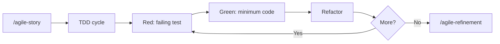

# TDD (Test-Driven Development)

Guide the Red-Green-Refactor cycle and pragmatic testing strategy. "Write tests. Not too many. Mostly integration."

Initial context received via slash: $ARGUMENTS

If `$ARGUMENTS` is filled (e.g., module name, feature description), use as starting point.
If empty, ask what will be tested.

## Language

Write artifacts and test descriptions in the user's language. When in doubt, ask. Test code itself (function names, assertions) stays in English.

## Project root

This skill writes artifacts at paths relative to the **project root** (the repo where the work happens), not the agent's current working directory.

- If invoked from inside the project, use the relative paths shown in this skill.
- If invoked from another directory (e.g., a sibling repo, or when the project lives elsewhere), prepend `<project-root>/` to every artifact path.
- When the project root is ambiguous, confirm with the user via the harness question tool before writing.

## Prompting

Follow the project-wide convention in `CLAUDE.md` / `AGENTS.md` ("Skill Prompting Conventions"). Use the harness's structured-question tool — `AskUserQuestion` (Claude Code), `ask_user_question` (Codex), or `question` (OpenCode) — for the decision points below. Use free-form text only where a path/name/value cannot be enumerated.

| Decision point | Why structured | Suggested options |
|---|---|---|
| Enforcement mode (when installing) | Hard-to-undo policy choice | warn · block · keep current |
| Test strategy (when ambiguous) | Affects file layout | sibling · sibling_dir · tests_root |
| Exempt a specific path | Edits guardrails config | yes · no · review later |

Free-form prompts (no structured tool):

- Test descriptions
- Exemption rationale

No-pause mode: if the user has explicitly disabled mid-skill clarification, convert every structured prompt into an entry under *Open questions* (or equivalent) and proceed without blocking.

## When to use

- Starting a new feature with TDD
- Adding tests to existing code
- Establishing test coverage for a module
- Unclear whether something needs unit, integration, or E2E tests

## When NOT to use

- Quick prototypes where tests add no value -- use `/agile-proto`
- Throwaway scripts
- Pure documentation changes

## TDD cycle

1. **Red** -- write a failing test that describes the desired behavior
2. **Green** -- write the minimum code to make it pass
3. **Refactor** -- improve structure without changing behavior
4. Repeat

Present each step explicitly. Do not skip Red -- the test must fail first.

## Test pyramid (pragmatic)

| Layer | Target | Focus |
|---|---|---|
| Unit | 60% | Pure functions, transformers, utils |
| Integration | 30% | Services, DB interactions, API routes |
| E2E | 10% | Critical user flows |

Overall coverage target: 75%+.

For front-end work, treat these percentages as risk guidance, not quotas. Prefer integration tests that exercise user behavior, validation, local state, API contracts, permissions, offline/sync behavior, and critical flows. Avoid tests that only assert static text, that a button rendered, or implementation details of a design-system component.

When a project keeps business rules in `planning/<initiative>/business/*.md`, use those rule IDs to decide what deserves tests. Tests should prove behavior behind important rules, not restate the rule text.

## File structure

- **Unit:** co-located with source (`foo.test.ts` beside `foo.ts`)
- **Integration/E2E:** `tests/` with `integration/`, `e2e/`, `helpers/`, `fixtures/`, `mocks/`
- **Naming:** `.test.ts` (unit/integration), `.e2e.test.ts` (E2E)
- **Never** `.spec.ts`

## Rules

- AAA pattern (Arrange / Act / Assert)
- One concept per test
- Descriptive names that read as sentences
- **Always** use factories (e.g., `faker`) over hardcoded data
- Isolate with `beforeEach` -- no shared state between tests
- Test behavior, not implementation details

## Anti-patterns (avoid)

- Interdependent tests (test A depends on test B running first)
- Arbitrary `sleep(ms)` -- use proper waits
- Testing private methods -- test through public API
- `console.log` in tests -- use proper assertions
- Order-dependent tests
- Mocking what you own (mock external dependencies, not your own code)

## Coverage targets (granular)

| Area | Target |
|---|---|
| Transformers / pure functions | 90%+ |
| Utils | 85%+ |
| Services | 80%+ |
| Routes / handlers | 70%+ |

## Commands (Bun)

```
bun test
bun test --watch
bun test --coverage
bun test --filter "name"
bun test src/dir/
```

Adjust for other runtimes (vitest, jest) as needed. Detect the project's test runner from `package.json` or config files before suggesting commands.

## Process

### 1. Understand what to test

Explore the code to understand:
- What module or feature needs tests
- What behaviors are critical
- What is already covered (check existing tests)
- Which business rule IDs, acceptance criteria, or prototype flows the change must satisfy

For front-end work backed by a Pen.dev prototype, inspect `design-system.lock.json` before starting Red. When it declares `prototype.path`:

1. Run the sibling Agile-Pen gate:

   ```bash
   node <agile-pen-skill>/scripts/ads.mjs verify --project <project-root>
   ```

2. Read `design/generated/prototype.catalog.json`, `design/generated/parity-audit.report.json`, and `design/generated/validation.manifest.json`.
3. Resolve every component instance needed by the target screen/state through `screen.instances[].componentId` to its catalog entry, capture provenance, registry, and checksum-locked `code[].path` counterpart.
4. Reuse or compose those mapped code counterparts. Do not recreate a shadcn, Dice UI, community-registry, or project-owned primitive under another name.
5. Stop before Red if the gate fails, coverage is below 100%, a manual component exists, a target screen/ref is absent, or a mapped code checksum is stale. Return the prototype to Agile-Pen for reconciliation; do not guess from visual similarity.

The parity catalog decides component identity and code location. TDD still decides observable behavior: test the screen flow, validation, permissions, state changes, and integration contracts rather than the internal markup of the mapped design-system component.

### 2. Choose the right test type

Use the test pyramid as guide:
- Pure function with no side effects? Unit test.
- Service that talks to DB or external API? Integration test.
- Critical user flow that spans multiple systems? E2E test.
- Front-end behavior with validation, API contract, permission, optimistic update, or offline/sync state? Integration test.
- Static copy, simple rendering, or visual-only detail with no rule? Usually no test unless it protects a known regression.

For local-first products, give priority to tests that cover command validation, optimistic state, offline queue persistence, reconciliation, conflict handling, permissions, and audit events.

### 3. Execute the TDD cycle

For each behavior:
1. Write the failing test (Red)
2. Implement the minimum code (Green)
3. Refactor if needed
4. Verify the test still passes

Record the business rule ID or acceptance criterion in the test description or surrounding story artifact when that mapping helps future refinement.

### 4. Verify coverage

Run coverage and check against targets. Fill gaps in critical areas first.

## Chaining

- During feature implementation: work inside the `/agile-story` checklist
- After implementation: `/agile-refinement` to review test quality
- Before closing: ensure tests are part of `/agile-status` (closure mode) verification
- If the TDD workflow exposes repeated friction, missing guidance, weak templates, or unclear verification, capture a concise skill feedback note with the affected skill/template, evidence, proposed change, and validation artifact.
- If repeated TDD friction suggests a skill/template change, use `/agile-skill-feedback` before editing the process library.

## Enforcement (optional, opt-in per project)

Beyond advisory guidance, this skill ships hook templates that turn the TDD rule into a project-level guardrail. When a project enables them, every implementation session is checked at the file-write level — without the agent having to remember to invoke this skill.

### What gets enforced

- **PreToolUse on `Write|Edit|MultiEdit`** — if the target file matches `source_paths` in `.tdd-guardrails.yml` and a companion test does not exist, the hook warns (`mode: warn`) or blocks the tool call (`mode: block`).
- **Stop hook** — at session end, scans the git diff and reports source files touched without a companion test.
- **SessionStart hook** — announces "TDD enforcement active" so the agent knows the rule is in force.

The hook templates live at `skills/agile-tdd/templates/hooks/*.sh.tmpl` and the config schema at `skills/agile-tdd/templates/tdd-guardrails.yml.tmpl`.

### Config (`.tdd-guardrails.yml`)

| Key | Meaning |
|---|---|
| `enabled` | Global on/off |
| `mode` | `warn` (stderr only) or `block` (PreToolUse rejects the call) |
| `source_paths` | Globs that require a companion test |
| `test_strategy` | `sibling` (`foo.ts` → `foo.test.ts`), `sibling_dir` (`__tests__/foo.test.ts`), or `tests_root` (`<app>/tests/integration/foo.test.ts`) |
| `exemptions` | Globs allowed without a test (entry points, generated files, UI primitives) |

**Pattern semantics:** the hook scripts use **bash `case` globs**, not extended globstar. In bash `case` patterns, `*` matches any sequence of characters including `/`; there is **no** `**`. So `apps/*/src/*.ts` matches both `apps/server/src/handler.ts` and `apps/server/src/auth/handler.ts`. Do not use `**` in `source_paths` or `exemptions`.

### Enforcement caveats

The hook checks file-pair existence — it does not, and cannot, verify:

- That the test was written **before** the source (no Red-before-Green order check).
- That the test actually exercises the source (no semantic match).
- That the test currently passes (no test execution).

Semantic discipline (one behavior per test, factories over hardcoded data, descriptive names, AAA) still belongs to the agent. The hooks are guardrails, not a guarantee.

### Manual install (until a `tdd-init` script exists)

Per-harness mechanics differ — Claude Code and Codex run shell hooks directly; OpenCode runs a JS plugin that orchestrates the same shell scripts.

1. Copy `templates/tdd-guardrails.yml.tmpl` to `<project-root>/.tdd-guardrails.yml` and edit `source_paths` and `exemptions` to match the repo layout.

   **Then run the project-type detectors** to populate `project_types`:

   ```bash
   for type in .claude/skills/agile-tdd/templates/project-types/*/; do
     name="$(basename "$type")"
     [ -f "$type/detect.sh" ] || continue
     bash "$type/detect.sh" "$PWD" && echo "detected: $name"
   done
   ```

   For each detected type, append its `guardrails.partial.yml` to the
   newly-created `.tdd-guardrails.yml` (or merge if the block already
   exists) and add the type slug to the `project_types` list.

2. Copy the hook templates. From `templates/hooks/` to
   `<project-root>/.claude/hooks/`, `<project-root>/.codex/hooks/`, **and**
   `<project-root>/.opencode/hooks/` (the OpenCode plugin invokes the
   same scripts via `node:child_process.spawn`). Drop the `.tmpl` suffix and
   `chmod +x`.

   **Also copy** the shared helpers:

   ```
   templates/lib/audit-helpers.sh.tmpl → .claude/hooks/lib/audit-helpers.sh
   ```

   and the project-types directory:

   ```
   templates/project-types/ → .claude/hooks/project-types/
   ```

   The session-audit script searches both locations. Codex/OpenCode
   should mirror under `.codex/hooks/` and `.opencode/hooks/`.

3. Register the hooks in each harness config:

   - **Claude Code** (`.claude/settings.json`): add a `PreToolUse` entry matching `Write|Edit|MultiEdit` calling `$CLAUDE_PROJECT_DIR/.claude/hooks/tdd-pre-write.sh`, a `Stop` entry calling `tdd-session-audit.sh`, and a `SessionStart` entry calling `tdd-announce.sh`. Merge with existing hooks — do not replace.
   - **Codex** (`.codex/hooks.json`): add `PreToolUse` matching `apply_patch|Edit|Write|MultiEdit`, `Stop`, and `SessionStart` entries. Use `bash "$(git rev-parse --show-toplevel)/.codex/hooks/<script>.sh"` as the command form (Codex pattern). Include `statusMessage` field for each.
   - **OpenCode**: copy `templates/opencode-plugin.js.tmpl` to `<project-root>/.opencode/plugins/tdd-guardrails.js`. The plugin subscribes to `tool.execute.before` (PreToolUse equivalent), `session.created` (SessionStart equivalent), and `session.idle` (closest to Stop — the audit shell is idempotent via a tmp state file so multi-firing is safe). The plugin spawns the same `.opencode/hooks/tdd-*.sh` scripts via `node:child_process.spawn`. OpenCode does **not** invoke shell scripts directly; the plugin is the entry point.

4. Append the contents of `templates/agents-block.md.tmpl` to `AGENTS.md` and `CLAUDE.md` so the agent is told the project has TDD enforcement.

   **For each detected project-type**, also append its
   `templates/project-types/<type>/agents-block.partial.md` to the same
   files (preserving the `<!-- agile-tdd:<type>:start --> / :end`
   markers so re-installs can update in place).

5. **Register the type-specific matchers** in `.claude/settings.json`:

   - For `tauri`: a `PostToolUse` entry matching
     `mcp__tauri__webview_screenshot|mcp__tauri__webview_execute_js|mcp__tauri__webview_dom_snapshot|mcp__tauri__manage_window`
     calling `$CLAUDE_PROJECT_DIR/.claude/hooks/tdd-record-mcp.sh`.

   The Codex equivalent goes in `.codex/hooks.json`; for OpenCode,
   subscribe to `tool.execute.after` filtered by tool name and spawn
   the same shell via `node:child_process.spawn`.

The hooks are guardrails, not a guarantee — they check file-pair existence, not test quality. Semantic discipline (one behavior per test, factories over hardcoded data) still belongs to the agent.

### Harness compatibility matrix

| Harness | Entry point | Pre-write event | Stop equivalent | Session start |
|---|---|---|---|---|
| Claude Code | `.claude/settings.json` hooks | `PreToolUse` (matcher `Write\|Edit\|MultiEdit`) | `Stop` | `SessionStart` |
| Codex | `.codex/hooks.json` hooks | `PreToolUse` (matcher `apply_patch\|Edit\|Write\|MultiEdit`) | `Stop` | `SessionStart` |
| OpenCode | `.opencode/plugins/tdd-guardrails.js` JS plugin | `tool.execute.before` | `session.idle` (closest available; audit is idempotent) | `session.created` |

### Bypassing intentionally

- For one path: add it to `.tdd-guardrails.yml → exemptions`.
- For one session: temporarily set `enabled: false` (and revert before commit).
- Never delete the test file just to silence the hook — that defeats the point.

## Project-type templates

Beyond the base companion-test rule, `agile-tdd` ships **project-type
templates** under `templates/project-types/<type>/`. Each template
opts into project-specific evidence that the Stop hook checks in
addition to companion tests. The session-audit script composes the
base check with one fragment per active type — modes are independent
per type, so you can run TDD in `warn` and a stricter type in `block`.

### Available types

| Type | Detects | Enforces (in addition to companion tests) |
|---|---|---|
| `tauri` | `src-tauri/Cargo.toml` (single-repo or monorepo) | `cargo check` fresh + `bun run typecheck` fresh + ≥1 `mcp__tauri__webview_screenshot` per affected app after the last edit |
| `pwa` | (planejado) `manifest.webmanifest` + service worker | service worker rebuilt + offline smoke test |
| `mobile` | (planejado) `app.json` (Expo) / `Podfile` / `android/build.gradle` | platform build green + simulator screenshot |
| `desktop` | (planejado) electron/forge config | electron-builder validate + window screenshot |

Active types are listed in `.tdd-guardrails.yml → project_types`. At
install, each `templates/project-types/<type>/detect.sh` runs against
the repo; types that succeed get appended to the config along with
their `guardrails.partial.yml` block.

### Anatomy of a type

A type is a folder with:

- `detect.sh` — exits 0 when the type applies to the repo.
- `guardrails.partial.yml` — block appended to `.tdd-guardrails.yml`.
- `agents-block.partial.md` — section appended to `CLAUDE.md`/`AGENTS.md`
  inside `<!-- agile-tdd:<type>:start -->` markers.
- `audit.partial.sh` — sourced by `tdd-session-audit.sh`. Exports
  `check_<type>_evidence "$ROOT"` returning textual violations. Sets
  `<TYPE>_MODE` (uppercase) so the framework can decide block vs warn.
- `hooks/*.sh.tmpl` — optional extra hooks the type registers (e.g.
  PostToolUse evidence recorder).
- `README.md` — human description of the type.

The framework calls helpers from `templates/lib/audit-helpers.sh` for
yml parsing, glob matching, app-root discovery, and freshness checks.
Adding a new type does not require touching the framework script.

### Installing types

The base `agile-tdd` install already follows the "Manual install" steps
above. For each detected type:

1. Append `templates/project-types/<type>/guardrails.partial.yml` to
   `.tdd-guardrails.yml` (or merge if the block already exists).
2. Append `agents-block.partial.md` to `CLAUDE.md`/`AGENTS.md` between
   the marker pair.
3. Copy `hooks/*.sh.tmpl` to `.claude/hooks/`, `.codex/hooks/`, and
   `.opencode/hooks/`, dropping the `.tmpl` suffix and `chmod +x`-ing.
4. Add the type's matcher to each harness config:
   - **Claude Code** (`.claude/settings.json` → `PostToolUse`): add a
     matcher entry for the type's PostToolUse hooks. For `tauri`:
     `mcp__tauri__webview_screenshot|mcp__tauri__webview_execute_js|mcp__tauri__webview_dom_snapshot|mcp__tauri__manage_window`
     calling `$CLAUDE_PROJECT_DIR/.claude/hooks/tdd-record-mcp.sh`.
   - **Codex** (`.codex/hooks.json`): same matcher pattern; command
     uses `bash "$(git rev-parse --show-toplevel)/.codex/hooks/tdd-record-mcp.sh"`.
   - **OpenCode**: extend `.opencode/plugins/tdd-guardrails.js` to
     subscribe to `tool.execute.after` with a filter on tool name,
     spawning the same shell script via `node:child_process.spawn`.
5. Append the type slug (e.g. `tauri`) to `project_types` in
   `.tdd-guardrails.yml`. The session-audit reads this list at run.

## Tauri MCP validation (project type)

Knowhow consolidated from real Tauri debug/test sessions. Read this
before touching `src-tauri/src/**` or any `src/{routes,components,hooks}/**`
in a Tauri-detected repo.

### Toolbox (canonical references)

- `mcp__tauri__driver_session(start)` — always invoke first; subsequent
  webview tools assume an active session.
- `mcp__tauri__webview_screenshot` — the canonical "I opened the
  screen" signal. Pass `windowId="main"` (Tauri apps usually have
  `main` + `tray-panel`).
- `mcp__tauri__webview_execute_js` — for invokes that take longer than
  the JS executor timeout (≈seconds), fire-and-forget via
  `window.__TAURI_INTERNALS__.invoke(cmd, args).then(r => window.__last = r)`;
  poll DB or screenshot instead of `await`-ing.
- `mcp__tauri__webview_interact` / `webview_find_element` / refs in
  `webview_dom_snapshot` — these depend on `window.__MCP__.resolveRef`
  which is **undefined after dev-server HMR reload**. Prefer
  `document.querySelector(...).click()` via `webview_execute_js`.

### Rebuild flow

- Rust change → `touch src-tauri/src/<file.rs>` forces `tauri-dev` to
  rebuild (cargo's mtime watcher).
- Monitor the dev process output for `Finished` + `MCP Bridge plugin
  initialized` before re-running MCP calls; HMR only covers the
  frontend.
- In Claude Code, prefer `Monitor` with the filter
  `tail -f tauri.log | grep --line-buffered -E "Finished|error\\[|MCP Bridge plugin initialized"`.

### Validation patterns

- **DB direct read** — cheaper than `invoke()` for state assertions:
  `sqlite3 <workspace>/<app>.db "SELECT ..."`.
- **GPU offload check** — `ps -p $(pgrep -x <app-name>) -o pcpu,etime`.
  Apps using Metal/CUDA show low CPU (5-15%) when the GPU is doing the
  work; CPU-only fallback shows 200-400%.
- **Visual check** — `location.assign('/route/...')` via
  `webview_execute_js`, wait ~500ms, then `webview_screenshot`.

### Known gotchas (cross-project patterns)

Each project keeps its own list of in-tree fixes (e.g. in a
`wiki/technical/tauri-gotchas.md` for projects that follow the LLM
wiki pattern). The items below describe the **patterns** — the actual
file paths vary per project.

- **whisper-rs 0.14.x `set_abort_callback_safe` type confusion** — in
  v0.14.4 the trampoline is instantiated with the original closure
  type, while `user_data` is actually written as
  `Box<dyn FnMut() -> bool>`. The callback dereferences the wrong
  memory layout and returns garbage bools, aborting whisper at 0–5%
  with error `-6`. Workaround: use the `unsafe` variant
  `set_abort_callback` + `set_abort_callback_user_data` with a
  hand-written trampoline that matches the stored type:

  ```rust
  unsafe extern "C" fn abort_trampoline(ud: *mut std::ffi::c_void) -> bool {
      let f = &mut *(ud as *mut Box<dyn FnMut() -> bool>);
      f()
  }
  let closure: Box<dyn FnMut() -> bool> = Box::new({
      let cancel = cancel.clone();
      move || cancel.load(Ordering::Relaxed)
  });
  let ud = Box::into_raw(Box::new(closure)) as *mut std::ffi::c_void;
  unsafe {
      params.set_abort_callback(Some(abort_trampoline));
      params.set_abort_callback_user_data(ud);
  }
  ```

- **Background jobs stuck `running` after binary kill** — a tokio task
  that dies mid-flight (cargo restart, app crash) never updates its
  DB row to a terminal state. Add a reconcile pass at pool-open:

  ```rust
  // db::open_pool, after schema migration
  sqlx::query(
      "UPDATE jobs SET status='cancelled',
           error_message=COALESCE(error_message,'interrupted by app restart'),
           finished_at=?
       WHERE status IN ('running','pending')"
  ).bind(now_iso()).execute(&pool).await?;
  ```

- **Modal libraries that couple `open` to data state** (e.g. Base UI
  Dialog, some Radix patterns) — when the data prop goes `null` in
  the same render that `open` flips false, the modal unmounts before
  the close animation finishes; pointer-events stay trapped on
  `document.body` and the page becomes unclickable. Decouple `open`
  (boolean) from the data, then defer the data clear with
  `setTimeout(..., 200)` (or use an `onCloseComplete` callback when
  the library exposes one).

- **`CREATE TABLE IF NOT EXISTS` is a no-op on existing tables** —
  reused workspaces / DBs do NOT pick up new columns added in the
  schema file. Symptom: runtime `no such column` after upgrade. Fix
  options: explicit `ALTER TABLE … ADD COLUMN IF NOT EXISTS` per
  drift; OR, if the DB has no production data, drop and re-bootstrap.

- **`hound::WavReader` only decodes WAV** — for `.mp3`/`.mp4`/`.m4a`/
  `.webm`, pipe through ffmpeg to `f32le @ 16 kHz mono` before
  feeding Whisper:

  ```rust
  // ffmpeg -hide_banner -loglevel error -nostdin -i <input>
  //   -ac 1 -ar 16000 -f f32le -
  let mut child = Command::new(ffmpeg)
      .args(["-hide_banner","-loglevel","error","-nostdin","-i"])
      .arg(input)
      .args(["-ac","1","-ar","16000","-f","f32le","-"])
      .stdout(Stdio::piped()).spawn()?;
  // read stdout, reinterpret bytes as &[f32]
  ```

### Definition of Done (Tauri)

For each change that touches `affected_paths` in **every affected
app** (monorepo: per-app):

1. `cargo check --manifest-path <app>/src-tauri/Cargo.toml --lib` green.
2. `bun run typecheck` (or `tsc --noEmit`) green.
3. `tauri-dev` showed `Finished` after the last `touch` in
   `<app>/src-tauri/src/**`.
4. Companion test exists (base TDD rule, if applicable).
5. **≥1 `mcp__tauri__webview_screenshot`** call after the last edit
   under `<app>/{src-tauri,src}/**`.
6. Post-operation state confirmed: DB query, DOM snapshot, or
   evidence visible in the screenshot.

The `tdd-session-audit.sh` Stop hook checks (1), (2), and (5)
automatically via the `tauri` template. Steps (3), (4), and (6) remain
agent responsibility.

## Relationship with the flow



This skill operates during execution. It pairs with `/agile-story` (which defines what to build) and feeds into `/agile-refinement` (which validates the result). When the optional enforcement is installed, the rule is also applied automatically at every `Write/Edit/MultiEdit` tool call.
